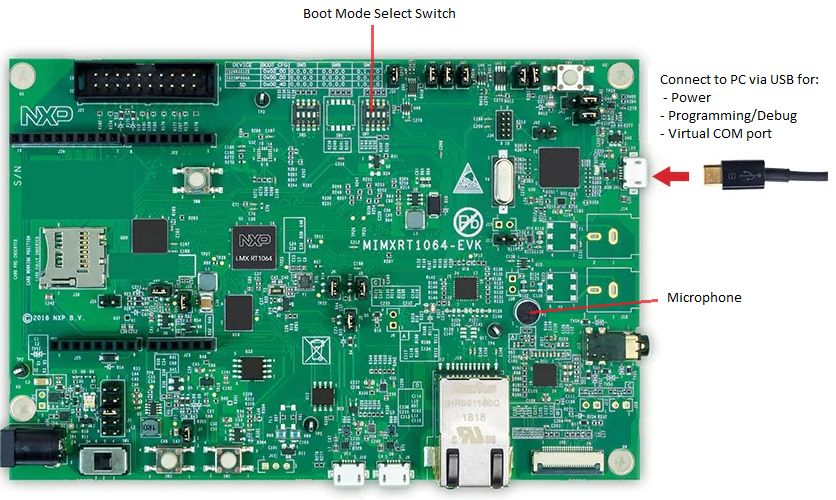
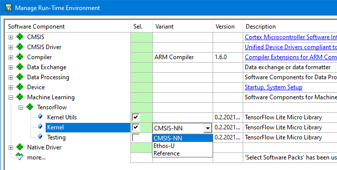
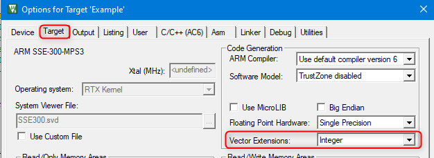

# Micro speech example {#mspeech}

An implementation of the micro speech example with VHT support is available at [github.com/MDK-Packs/VHT-TFLmicrospeech](https://github.com/MDK-Packs/VHT-TFLmicrospeech).

The program analyzes an audio input with a voice recognition model that can detect 2 keywords - **yes** and **no**. The recognized keywords are then printed into a serial interface. The voice recognition model is implemented using [TensorFlow Lite for Microcontrollers](https://www.tensorflow.org/lite/microcontrollers). 

The example project can be executed on \ref mspeech_vht "\prj_name" as well as on \ref mspeech_hw "hardware". This demonstrates how to use the processor and peripheral abstraction layers for simpler software portability across different targets.

## Structure

The table below explains the content in the micro speech example's repository.

Folder                                                | Description
:-----------------------------------------------------|:--------------------
`./micro_speech/`                                       | Contains the voice recognition model that is used by all targets. This part is similar to the original TF-Lite for Microcontrollers example, with just minor modifications.<br>TensorFlow calculation kernel is provided separately via corresponding software packs listed in \ref mspeech_pre and as explained in \ref tf_variants.
`./Platform_FVP_Corstone_SSE-300_Ethos-U55/`            | Project files specific for executing the program on VHT. See \ref mspeech_vht for details and execution instructions.
`./Platform_MIMXRT1064-EVK/`                            | Project files specific for executing the program on MIMXRT1064-EVK. See \ref mspeech_hw for details and execution instructions.
`./VSI`                                                 | Implementation of Audio Streaming Interface via VSI. See [**Simulation**](../../simulation/html/index.html) chapter for details. 

## Prerequisites {#mspeech_pre}

Following items are required for running the micro speech example on a PC:

- **Toolchain**
  - IDE (Windows only): [MDK Microcontroller Development Kit](https://www.keil.com/mdk5)
  - alternatively, command-line building tool: [CMSIS-Build](https://github.com/ARM-software/CMSIS_5/releases/download/5.7.0/cbuild_install.0.10.2.sh)

- [**Common public CMSIS Software Packs**] (https://developer.arm.com/tools-and-software/embedded/cmsis/cmsis-packs)
  - ARM::CMSIS 5.8.0
  - Keil::ARM_Compiler 1.6.3

- **Non-public TensorFlow CMSIS Software Packs**
  - [tensorflow.flatbuffers.0.1.20210719](https://github.com/MDK-Packs/tensorflow-pack/releases/download/preview-0.3/tensorflow.flatbuffers.0.1.20210719.pack)
  - [tensorflow.gemmlowp.0.0.1.20210719](https://github.com/MDK-Packs/tensorflow-pack/releases/download/preview-0.3/tensorflow.gemmlowp.0.0.1.20210719.pack)
  - [kissfft.0.1.20210719](https://github.com/MDK-Packs/tensorflow-pack/releases/download/preview-0.3/tensorflow.kissfft.0.1.20210719.pack)
  - [tensorflow.ruy.0.1.20210719](https://github.com/MDK-Packs/tensorflow-pack/releases/download/preview-0.3/tensorflow.ruy.0.1.20210719.pack)
  - [tensorflow.tensorflow-lite-micro.0.2.20210719](https://github.com/MDK-Packs/tensorflow-pack/releases/download/preview-0.3/tensorflow.tensorflow-lite-micro.0.2.20210719.pack)
  - [Arm.ethos-u-core-driver.0.1.20210719](https://github.com/MDK-Packs/tensorflow-pack/releases/download/preview-0.3/Arm.ethos-u-core-driver.0.1.20210719.pack) (for virtual target with Ethos-U55)

- **Specific for \prj_name**
  - [public CMSIS software packs](https://developer.arm.com/tools-and-software/embedded/cmsis/cmsis-packs) for target support:
    - ARM::V2M_MPS3_SSE_300_BSP 1.2.0
  - for targets with VSI support
    - [Python 3.9](https://www.python.org/downloads/)
    - [Fast Models](https://developer.arm.com/tools-and-software/simulation-models/fast-models) 11.15
    - FVP model for Corstone-300 MPS3 with VSI support
      - The prebuilt model binaries are available as assets in Git under [**Releases**](https://github.com/RobertRostohar/Orta/releases). The contents of `FVP_VSI_Corstone_SSE-300_Ethos-U55_xxx.zip` shall be extracted into directory `./VHT/Build_Corstone_SSE-300_Ethos-U55/system`.
      - Alternatively, the model executable can be built manually as explained in `./VHT/README.md`.
  - for targets without VSI support
    - [Ecosystem FVP for Corstone-300 MPS3](https://developer.arm.com/tools-and-software/open-source-software/arm-platforms-software/arm-ecosystem-fvps)

- **Specific for HW target**
  - [NXP MIMXRT1064-EVK](https://www.nxp.com/design/development-boards/i-mx-evaluation-and-development-boards/mimxrt1064-evk-i-mx-rt1064-evaluation-kit:MIMXRT1064-EVK)
  - [public CMSIS packs](https://developer.arm.com/tools-and-software/embedded/cmsis/cmsis-packs):
    - ARM::CMSIS-Driver 2.6.1
    - NXP::MIMXRT1064_DFP 13.0.0
    - NXP::EVK-MIMXRT1064_BSP 13.0.0
    - Keil::MIMXRT1064-EVK_BSP 1.2.1
    - Keil::iMXRT1064_MWP 1.4.0

## Program Execution

The example project can be executed on \ref mspeech_vht "\prj_name" as well as on \ref mspeech_hw "hardware" as explained in this section.

### Running on \prj_name {#mspeech_vht}

Directory `./VHT-TFLmicrospeech/Platform_FVP_Corstone_SSE-300_Ethos-U55/` in the example repository contains the project files for executing the program on VHT.

The project can be executed on two types of targets:
  - **with VSI support**: implements audio driver on VSI peripheral with audio test data provided through Python script as explained in [**Simulation**](../../simulation/html/index.html) chapter.
  - **without VSI support**: integrates audio test data into embedded code and can be run on ecosystem FVPs without VSI support.

Below is the description of available project targets with execution instructions:

**Example** target runs on a VHT **with VSI support**:
  - Uses customized Corstone SSE-300 Ethos-U55 FVP with Virtual Streaming Interface (VSI). Refer to virtual platform setup described in \ref mspeech_pre.
  - Audio test data is provided by the Python script `./VHT-TFLmicrospeech/VSI/audio/python/arm_vsi0.py` from the WAVE file `./VHT-TFLmicrospeech/Platform_FVP_Corstone_SSE-300_Ethos-U55/test.wav` which contains keywords 'Yes' and 'No' alternating three times.
  - Open the example with Keil MDK (Windows only) using the uVision project  `./VHT-TFLmicrospeech/Platform_FVP_Corstone_SSE-300_Ethos-U55/microspeech.uvprojx` and build it for target `Example`.
  - Alternatively compile with CMSIS-Build using `microspeech.Example.cprj` project.
  - Run the compiled example with MDK or standalone with script `run_example.cmd`.
  - When running the example the audio data is processed and detected keywords are output to the Telnet terminal with their time stamps in the audio stream. Following output can be observed for the default test.wav file included with the example:
      <br><c>
        Heard yes (152) @1100ms <br>
        Heard no (141) @5500ms <br>
        Heard yes (147) @9100ms <br>
        Heard no (148) @13600ms <br>
        Heard yes (147) @17100ms <br>
        Heard no (148) @21600ms <br>
      </c>

**Example Test** is an internal test for the Example target<br>

**Audio Provider Mock** runs on a VHT **without VSI support**:
    - Uses [**ecosystem FVP for Corstone-300 MPS3**](https://developer.arm.com/tools-and-software/open-source-software/arm-platforms-software/arm-ecosystem-fvps).
	  - By default following path is used for the FVP: `c:\Program Files\ARM\FVP_Corstone_SSE-300_Ethos-U55\models\Win64_VC2017\FVP_Corstone_SSE-300_Ethos-U55.exe`. Update it in the uVision project or in the execution script if necessary.
    - Audio test data is embedded in the test code and contains keywords 'Yes' and 'No' alternating indefinitely.
    - Build example with MDK using uVision project `microspeech.uvprojx` target `Audio Provider Mock` or with CMSIS-Build using `microspeech.Audio_Provider_Mock.cprj` project.
    - Run example with MDK or standalone with script `run_audio_provider_mock.cmd`.
    - When running the example the audio data is processed and detected keywords are continuously output to the Telnet terminal with their time stamps in the audio stream. Following output can be observed for the default test.wav file included with the example:
      <br><c>
        Heard silence (149) @400ms <br>
        Heard yes (158) @1200ms <br>
        Heard no (143) @5600ms <br>
        Heard yes (149) @9100ms <br>
        Heard no (142) @13600ms <br>
        Heard yes (149) @17100ms <br>
        Heard no (142) @21600ms <br>
		...
      </c>

<b>Audio Provider Mock Test</b>: internal test for Audio Provider Mock target

### Running on a hardware target {#mspeech_hw}

Directory `./VHT-TFLmicrospeech/Platform_MIMXRT1064-EVK/` in the example repository contains the project files for executing the program on [NXP MIMXRT1064-EVK](https://www.nxp.com/design/development-boards/i-mx-evaluation-and-development-boards/mimxrt1064-evk-i-mx-rt1064-evaluation-kit:MIMXRT1064-EVK) development board with an Arm Cortex-M7 processor. One target **MIMXRT1064-EVK** is provided in the project.

This project uses the on-board microphone for audio input and prints recognized keywords to the serial interface.

The hardware setup is simple and requires only connection to the PC via USB. The project is configured to load the program to QSPI NOR flash so the boot switch SW7 shall be set to 0010.



Execute the program in following steps:
 - Build example with MDK using uVision project `microspeech.uvprojx` or with CMSIS-Build using `microspeech.MIMXRT1064-EVK.cprj` project.
 - Program and run the example with MDK or use Drag-and-drop programming through the DAP-Link drive.
 - Open the DAP-Link Virtual COM port in a terminal (baudrate = 115200), speak the keywords and monitor recognition results in the terminal window.

## TensorFlow-Lite kernel variants {#tf_variants}

The micro speech example uses **tensorflow-lite-micro** pack that contains **Machine Learning** software component implementing among others the universal kernel for executing TensorFlow ML operations independent from the actual load type (audio, video, or others).

Implementation of these kernel operations is available in several variants optimized for Arm targets. When using the uVision project the variant can be selected in **Manage Run-Time Environment** window as shown on the picture below.



When using CMSIS-Build the kernel variant is specified in the .cprj project file in the line:
```
    <component Cclass="Machine Learning" Cgroup="TensorFlow" Csub="Kernel" Cvariant="CMSIS-NN" Cvendor="tensorflow"/>
```
Following kernel variants are available:
- **CMSIS-NN**<br>Optimizes execution on Cortex-M devices by using mathematical functions from [CMSIS-NN software library](https://arm-software.github.io/CMSIS_5/NN/html/index.html).<br>
Underlying implementations automatically utilize target-specific hardware extensions such as [**Helium**](https://developer.arm.com/architectures/instruction-sets/simd-isas/helium) (or 
MVE: M-Profile Vector Extensions) and [**SIMD**](https://developer.arm.com/architectures/instruction-sets/dsp-extensions/dsp-for-cortex-m) (Single Instruction Multiple Data) and so maximize computing performance and reduce code footprint.<br>
For devices with MVE (such as Cortex-M55), there is additional configuration field **Vector Extensions** in the **Options for Target..**-[**Target**](https://www.keil.com/support/man/docs/uv4/uv4_dg_adstarg.htm) dialog, that specifies MVE use in the project.
.

- **Ethos-U**<br>(Not functional at this moment). Uses implementation optimized for Arm Ethos-U NPUs.

- **Reference**<br>Target-independent software implementation is used. Fallback solution for operations that cannot be optimized for target hardware.

## Performance measurement

File `./micro_speech/src/main_functions.cc` in the repository example contains [Event Statistics](https://www.keil.com/pack/doc/compiler/EventRecorder/html/es_use.html) annotations that allow to measure performance of ML algorithms in different configurations. This currently works only in setup with Keil MDK. [This video](https://armkeil.blob.core.windows.net/developer/Files/videos/KeilMDK/yDBbd3lQehXV.mp4) demonstrates program execution including the views into Event Statistics.

There are three events defined:
- **Event C0**: signal processing part that creates a spectrogram from the current data slice.

- **Event C1**: ML inference algorithm for the created spectrogram. Most compute-intensive part.

- **Event C2**: Verifies if a keyword was detected.

Execute the program with different \ref tf_variants and compare the Event Statistics output. Implementations optimized for Arm hardware extensions provide significant performance improvement C1 measurement and also shorten C0 duration.
