# Get Started Example {#GetStarted}

[comment]:[TOC]

GetStarted example demonstrates how to setup a Continuous Integration (CI) workflow for testing and debugging embedded applications using Arm Virtual Hardware (AVH). The project is maintained in the GitHub repository [**github.com/ARM-software/AVH-GetStarted**](https://github.com/ARM-software/AVH-GetStarted/) that also contains detailed description of the example.

This chapter provides step-by-step guide through the CI workflow operation and its setup.

## Overview {#GS_Overview}

The AVH GetStarted example implements common steps in the CI workflow as shown on the figure below and explained in subsequent sections.

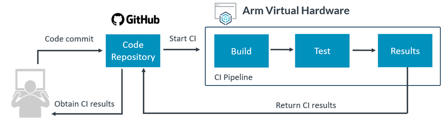

1. \ref GS_DevelopTest "Local development": at first, the software is developed locally using a common embedded toolchain such as [Keil MDK](https://developer.arm.com/tools-and-software/embedded/keil-mdk) and with [Arm Fixed Virtual Platforms](../../simulation/html/index.html) used for MCU simulation.<br>
 A GitHub repository is used as a source code management system for synchronization, storage and version control.
2. \ref GS_SetupCI "CI pipeline setup": a GitHub Action implements the CI pipeline that gets triggered on every code update in the target repository.
3. \ref GS_ExecuteCI "CI execution": automated program build and testing is performed in the cloud with Arm Virtual Hardware and results are reported back to the repository.
4. \ref GS_AnalyseFailure "Failure analysis and local debug": developer can observe the CI test results in the GitHub Actions of the repository. In case of any failures they can be reproduced and debugged locally.

## Prerequisites {#GS_Prerequisites}

Following is required to reproduce operation of the example project:

* a [GitHub](https://github.com/) account
* an [AWS](https://aws.amazon.com/) account
* a Windows PC with administrator rights

Other necessary software items are available free-of-charge and their installation is described in the related steps.

## Develop tests {#GS_DevelopTest}

The AVH GetStarted embedded program implements a set of unit tests for validating operation of a simple function that is expected to return the sum value of two integer arguments. The example uses [Unity Framework](https://github.com/ThrowTheSwitch/Unity) for test implementation and execution, however, the demonstrated concept is universal and can be applied to a different testing framework as well.

### Create repository on GitHub

Initial project repository setup should follow a standard git process for either [creating a new repo] (https://docs.github.com/en/get-started/quickstart/create-a-repo) or [forking](https://docs.github.com/en/get-started/quickstart/fork-a-repo) an existing one.
The AVH GetStarted repository is set up as a GitHub template repository so it is very easy to [create own repository from it](https://docs.github.com/en/repositories/creating-and-managing-repositories/creating-a-repository-from-a-template):
 - Open a web browser and go to the URL: [https://github.com/ARM-software/AVH-GetStarted](https://github.com/ARM-software/AVH-GetStarted)
 - Verify that you are logged in to your GitHub account.
 - Click on *Use this template* button. This opens the _Create a new repository from AVH-GetStarted_ page.
 - In *Repository name* field provide the name for the new repository to be created under your account. For simplicity just reuse the original name `AVH-GetStarted`.
 - Select whether you want the new repository to be Public or Private. This does not impact example operation, but be aware of limited quotas for automation in private repositories depending on your [GitHub account plan](https://github.com/pricing).
 - Check *Include all branches*. This is important for getting GitHub badges working correctly in your target repo.
 - Click on *Create repository from template*.
   - The example repo gets copied into `` `https://github.com/<YourGitHubName>/AVH-GetStarted` `` repository, where ```<YourGitHubName>``` corresponds your GitHub user name.
   .
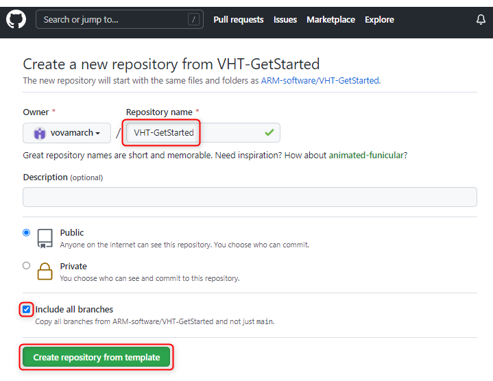

### Setup local project on your PC

**Local repository setup**

If the repository is present on GitHub, it can be easily copied onto local PC.
 - Make sure Git Bash is installed on the PC. For example [git for Windows] (https://gitforwindows.org/).
 - Open the Git Bash terminal in the target directory and execute clone command as:

        git clone https://github.com/<YourGitHubName>/AVH-GetStarted

This copies the content of the _main_ branch to on your local drive. The _badges_ branch is present in the GitHub repository but is not required for local use.

**Project setup**

 - Install Keil MDK and related tools as described in [Tools installation](../../infrastructure/html/run_mdk_pro.html#mdk_vht_install).
 - In the local project repository double-click on the _basic/basic.debug.cprj_ file to get the project imported into µVision IDE.
   - Alternatively you can start µVision IDE and import the basic.debug.cprj project via the [_Project_ - _Import_](https://developer.arm.com/documentation/101407/latest/User-Interface/Project-Menu-and-Commands/Export-Menu) menu.
 - Verify the project setup as explained in [Project Configuration](../../infrastructure/html/run_mdk_pro.html#mdk_project_config).

### Implement tests

The _main.c_ file in the example implements a set of unit tests validating the application function ```int my_sum(int a, int b)```. The implementation relies on the [Unity Framework](https://github.com/ThrowTheSwitch/Unity) that is added to the example as a software component with the [Unity software pack](https://github.com/MDK-Packs/Pack/tree/master/Unity). In the example, the `test_my_sum_fail` demonstrates a test failure and section \ref GS_AnalyseFailure explains how to analyze CI output for debugging such failed tests. 

The implementation of tests in the example can be considered as a template for adding more tests, covering other functions, or setting up unit testing in a custom project. Please refer to the documentation in [Unity GitHub] (https://github.com/ThrowTheSwitch/Unity) for further details and more complex examples.

**Redirect stdout**

By default Unity uses `putchar` for print out. Keil MDK does not support semihosting and hence standard output needs to be redirected to become visible during debug session. [**Redirect I/O**](https://www.keil.com/pack/doc/compiler/RetargetIO/html/index.html) component enables several mechanisms for that. In our example stdout output gets redirected to a UART interface.

**Build and Run the example in Keil MDK**

Build and execute the program in Keil MDK in the same way as any other project. Refer to [Program Build and Debug](../../infrastructure/html/run_mdk_pro.html#mdk_program_run) for additional description.

The GetStarted example is configured to open a local Telnet console automatically when the debug session starts. By default the following output shall be observed there, indicating an intentional failure in `test_my_sum_fail`:

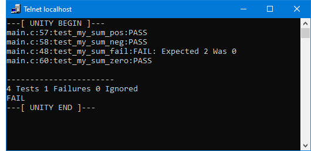

**Export project to CPRJ format**

The GetStarted example is also described in _basic.debug.cprj_ file using universal [.cprj format](https://arm-software.github.io/CMSIS_5/Build/html/cprjFormat_pg.html) that gets used in command-line CI environments.

For correct workflow operation it is important to keep the MDK project *uvprojx* file and the *cprj* file synchronized. For that after saving modifications in the MDK project go to the µVision menu [_Project_ - _Export_](https://developer.arm.com/documentation/101407/latest/User-Interface/Project-Menu-and-Commands/Export-Menu) and select _Save project to CPRJ format_.

## Setup CI pipeline {#GS_SetupCI}

As common for many projects, the CI pipeline for the AVH Get Started repository is triggered on every code change via push and pull requests. In our example this is explicitly limited to the _main_ branch only.

The CI implementation in this example is implemented with [GitHub Actions](../../infrastructure/html/run_ami_github.html). [AVH Client](../../infrastructure/html/avhclient.html) manages the connection between the GitHub repository and the Arm Virtual Hardware AMI instance in AWS, and configures the actions to be performed on the AMI, such as program build and execution.

Subsections below explain the setup for the AWS and GitHub Actions.

### AWS setup {#GS_AWS_Setup}

On the AWS side several items shall be setup to enable execution of example CI pipeline on Arm Virtual Hardware AMI.

**Arm Virtual Hardware AMI subscription**

 - Enable use of Arm Virtual Hardware AMI in your AWS account with the steps described in [Subscribe Arm Virtual Hardware](../../infrastructure/html/AWS.html#Subscribe).
  - Note the AMI ID value as it will be needed later for \ref GS_GitHub_Setup.

**AWS resources setup**

 - Provision the AWS resources required for using Arm Virtual Hardware AMI.
  - The simplest way is explained in [Arm Virtual Hardware AWS-CloudFormation](https://github.com/ARM-software/AVH-GetStarted/tree/main/infrastructure/cloudformation) and relies on AWS CloudFormation service with the template file specifying default stack configuration.
   - Note the parameters available in the _Output_ tab of the created stack. They will be needed later for \ref GS_GitHub_Setup.
  - Alternatively, for a more customized setup see [GitHub-hosted Runners](../../infrastructure/html/run_ami_github.html#GitHub_hosted).
 - Ensure that a Key Pair is available for use with EC2.<br>
   By default the AVH GetStarted example expects a key pair with name `common` to create an EC2 instance (with line `ssh_key_name: common` in _basic.yml_ file).
  - In AWS Management Console type _EC2_ and go to the EC2 service.
  - In the left menu find _Network & Security_ section and click on _Key Pairs_.
  - Verify that the same AWS region is selected as will be used with Arm Virtual Hardware AMI later.
  - If no `common` key pair exists then click on _Create key pair_ button. <br>
    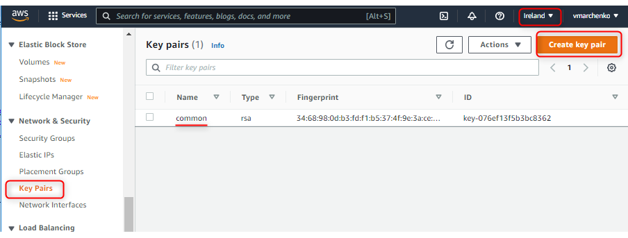<br>
  - In the _Create key pair_ dialog provide `common` as _Name_. Other settings can be kept at default values.
  - Click on _Create key pair_.
  - Save the file with the private key locally when corresponding file dialog opens. <br>
    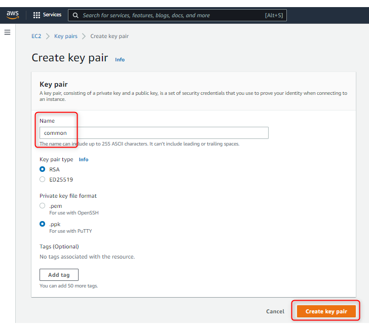
  - Observe the created Key Pair appears in the list.

### GitHub Actions setup {#GS_GitHub_Setup}

Section [Run AMI with GitHub Actions](../../infrastructure/html/run_ami_github.html) introduces the concept and explains it in details.

The GitHub Action in this example is implemented in the [./.github/workflows/basic.yml](https://github.com/ARM-software/AVH-GetStarted/blob/main/.github/workflows/basic.yml) file using corresponding [YAML syntax for GitHub workflows](https://docs.github.com/en/actions/learn-github-actions/workflow-syntax-for-github-actions).

**Add GitHub Secrets**

Several parameters need to be configured in the repository as [GitHub Secrets](https://docs.github.com/en/actions/security-guides/encrypted-secrets) to enable communication with your AWS account. For that:
 - Go to the GitHub webpage of your repository.
 - Go to *Settings* tab and in the list on the left side select _Secrets_.
 - Use button _New repository secret_ and add one by one following secrets:
 .
<table>
<tr><th> Secret Name </th><th> Value for your AVH-GetStarted repository </th><th> Description </th></tr>
<tr><td> AWS_IAM_PROFILE</td>
    <td> The value of _AVHIAMProfile_ from the output of [AWS resources setup](#GS_AWS_Setup).</td>
    <td> The [IAM Instance Profile](https://docs.aws.amazon.com/AWSEC2/latest/UserGuide/iam-roles-for-amazon-ec2.html) to be used for AWS access.</td></tr>
<tr><td> AWS_ACCESS_KEY_ID<br>AWS_SECRET_ACCESS_KEY</td>
    <td> The values of _AVHAccessKeyId_ and _AVHSecretAccessKey_ respectively from the output of [AWS resources setup](#GS_AWS_Setup).</td>
    <td> [Access key pair](https://docs.aws.amazon.com/IAM/latest/UserGuide/id_credentials_access-keys.html) for the AWS account (as IAM user) that shall be used by the CI workflow for AWS access.</td></tr>
<tr><td> AWS_S3_BUCKET_NAME </td>
    <td> The value of _AVHS3BucketName_ from the output of [AWS resources setup](#GS_AWS_Setup).</td>
    <td> The name of the [S3 storage bucket](https://docs.aws.amazon.com/AmazonS3/latest/userguide/creating-buckets-s3.html) to be used for data exchange between GitHub and Arm Virtual Hardware AMI.</td></tr>
<tr><td> AWS_SECURITY_GROUP_ID </td>
    <td> The value of _AVHEC2SecurityGroupId_ from the output of [AWS resources setup](#GS_AWS_Setup).</td>
    <td> The id of the [VPC security group](https://docs.aws.amazon.com/vpc/latest/userguide/VPC_SecurityGroups.html) to add the EC2 instance to. Shall have format `sg-xxxxxxxx`.</td></tr>
<tr><td> AWS_DEFAULT_REGION </td>
    <td> Use the same region as was used for [AWS setup](#GS_AWS_Setup).</td>
    <td> The data center region the Arm Virtual Hardware AMI will be run on. For example `eu-west-1`.</td></tr>
<tr><td> AWS_SUBNET_ID </td>
    <td> Obtain a value as described in [View your subnet](https://docs.aws.amazon.com/vpc/latest/userguide/working-with-vpcs.html#view-subnet).</td>
    <td> The id of the [VPC subnet](https://docs.aws.amazon.com/vpc/latest/userguide/VPC_Subnets.html#subnet-basics) to connect the EC2 instance to. Shall have format `subnet-xxxxxxxx`.</td></tr>
</table>

## Execute CI {#GS_ExecuteCI}

CI pipeline gets executed automatically on every code change in the _main_ branch and execution results can be observed on the repository GitHub page.

 - Go to the GitHub webpage of the repository.
 - Go to _Actions_ tab.
  - In _Workflows_ area you can see the list of GitHub workflows defined in the repository. In our example there is just one defined by *./.github/workflows/basic.yml* file in the repository.
 - Select the workflow and its runs will be displayed on the page. Note that right after copying the repository the list is empty because no workflows are executed yet.
   -  Use _Run workflow_ to manually trigger execution of this workflow on the initial codebase.<br>
    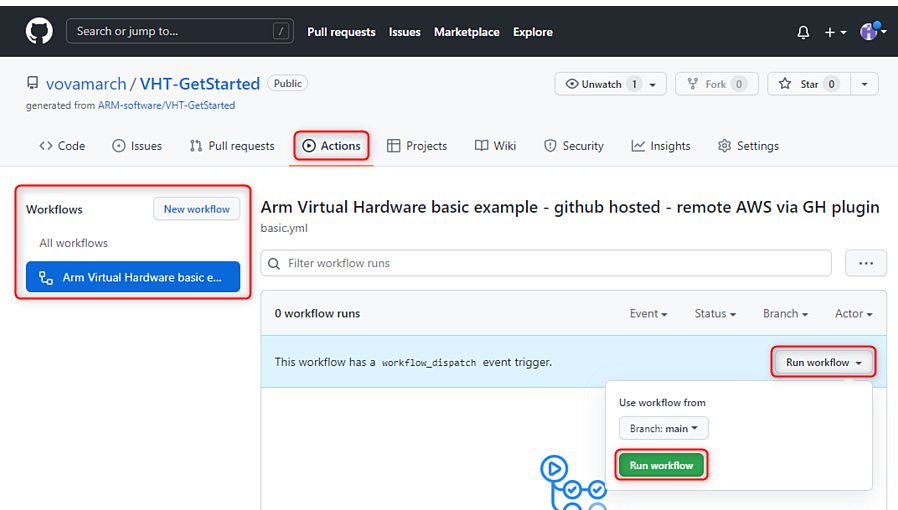
   - Wait until workflow execution is completed.<br>
     In this example it shall have success status indicated with a green circle icon. This only means that the CI pipeline execution was successful, but the actual test results are not considered (where one unit test is intentionally failing).<br>
   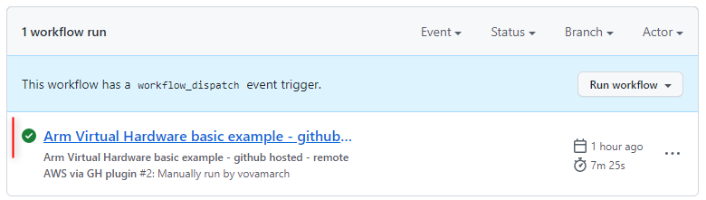
 - Click on the title of the workflow run to analyze its execution as explained in next section.

## Analyze failures {#GS_AnalyseFailure}

[GitHub Documentation](https://docs.github.com/en/actions/monitoring-and-troubleshooting-workflows/about-monitoring-and-troubleshooting) gives an overview about monitoring and troubleshooting options available for GitHub Actions.

Steps below guide through the analysis for AVH GetStarted example.

- Observe the three CI jobs executed in the selected CI workflow as shown in the _Jobs_ area on the left side.
  - **ci_test** job executes the CI pipeline without doing any analysis of unit test results. It is considered as successful (green circle) when the CI pipeline was executed fully to the end.
  - **badge** job generates [GitHub badges](https://docs.github.com/en/actions/monitoring-and-troubleshooting-workflows/adding-a-workflow-status-badge) for the _README.md_ file to make the CI workflow status easily visible. The _badge_ job is shown as successful when badge generation worked correctly.
  - **Test results** job analyses actual results of the unit test execution in the CI. Green checkmark indicates that all executed tests pass.
  .
  By default the execution result of three CI jobs defined in this GetStarted example appears as follows:<br>
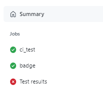
- In the _Artifacts_ area click on _results_ to download an archive file with additional details about the test run. It contains:
  - <i>basic.axf</i> binary image that was built and tested in the CI run.
  - <i>.log</i> file with program execution output.
  - <i>.xunit</i> file with unit test results.

- Click on _ci_test_ or _badge_ jobs to open corresponding [run log](https://docs.github.com/en/actions/monitoring-and-troubleshooting-workflows/using-workflow-run-logs) that can be explored for execution details. For example for _ci_test_:<br>
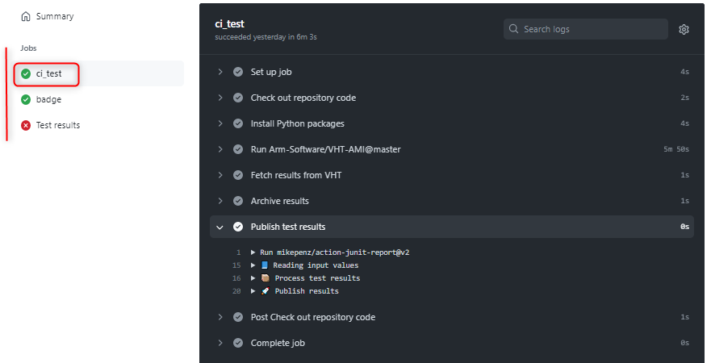

- Click on _Test results_ job that analyses the results of the executed tests. 
It can be seen that in default setup 1 out of 4 tests fails. The specific location (_check on line 48 in main.c_) and the reason (_Expected 2 Was 0_) for the failure are shown as well.<br>
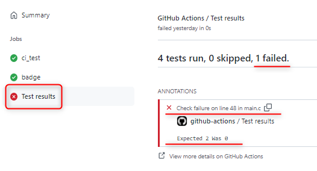

This allows to find the failure quickly. In our example it is a trivial one, introduced on purpose in the example code.
- Return to the AVH GetStarted project in Keil MDK on your PC.
- Open _main.c_ file.
- In line 48 replace the incorrect value `2` with the correct `0`:

        TEST_ASSERT_EQUAL_INT(0, sum);

- Rebuild the project.
- Start debug session and observe in Telnet client that all tests pass: <br>
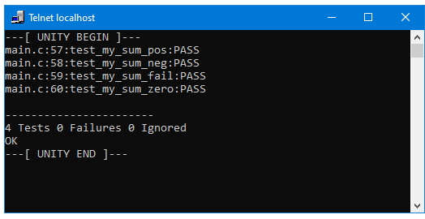<br>
- Although this specific change only impacts _main.c_ file, it is a good practice to also export the project to .cprj format to ensure it is synchronized with the MDK project.
- Open the Git bash in your local repository and execute following commands that upload only the updated *main.c* file to your _main_ repository:

        git commit basic/main.c -m "Fixed test_my_sum_fail"
        git push

- Go to GitHub Actions page of your repository.
- Observe that the CI workflow was automatically started with the code change. When it gets completed the _Test results_ job shall indicate that there were no test failures.<br>
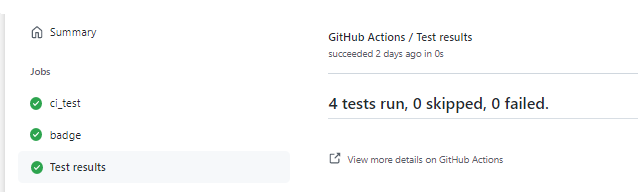
