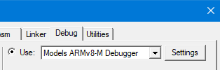
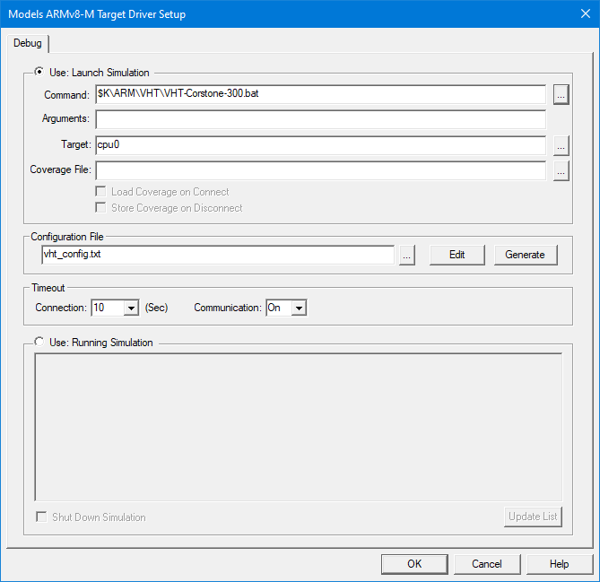

# Get Started Example {#GetStarted}

VHT Basic example demonstrates how to setup a Continuous Integration (CI) workflow for testing and debugging embedded applications using Arm Virtual Hardware (AVH). The project is maintained in GitHub repository [**github.com/ARM-software/VHT-GetStarted**](https://github.com/ARM-software/VHT-GetStarted/) that also contains detailed description of the example.

This chapter provides step-by-step guide through the CI workflow operation and its setup.

## Overview {#GS_Overview}

The VHT Basic example implements common steps in the CI workflow as shown on the figure below.


The steps are explained in more details in the subsequent sections.
1. \ref DevelopTest "Local development": at first, the software is developed locally using common embedded toolchain such as [Keil MDK](https://developer.arm.com/tools-and-software/embedded/keil-mdk) and with [Arm Virtual Hardware Target (VHT)](../../simulation/html/index.html) used for MCU simulation. <br>
 A GitHub repository is used as a source code management system for synchronization, storage and version control.
2. \ref SetupCI "CI pipeline setup": a GitHub Action implements the CI pipeline that gets triggered on every code update in the repository.
3. \ref ExecuteCI "CI execution": automated program build and testing is performed in AVH cloud environment and results are reported back to the repository.
4. \ref AnalyseFailure "Failure analysis and local debug": developer can observe the CI test results in the GitHub Actions of the repository. In case of any failures they can be reproduced and debugged locally.

## Prerequisites

Following is required to reproduce operation of the example project:

* a valid [GitHub](https://github.com/) account
* a valid [AWS](https://aws.amazon.com/) account
* a Windows PC with administrator rights

Other necessary software items are freely available and their installation is described in the related steps.

## Develop tests {#DevelopTest}

The VHT Basic embedded program implements a set of unit tests for validating operation of a simple function that is expected to return the sum value of two integer arguments. The example uses [Unity Framework](https://github.com/ThrowTheSwitch/Unity) for test implementation and execution, however, the demonstrated concept is universal and can be applied for a different testing framework as well.

### Create project repository in GitHub
Initial repository setup should follow a standard git process for either [creating a new repo] (https://docs.github.com/en/get-started/quickstart/create-a-repo) or [forking](https://docs.github.com/en/get-started/quickstart/fork-a-repo) already existing one.
In this example we use a fork of the VHT GetStarted repository:
 - Open a web browser and enter the URL: [https://github.com/ARM-software/VHT-GetStarted](https://github.com/ARM-software/VHT-GetStarted)
 - Log in to your GitHub account and click on *Fork* (upper right side).
   - The repo gets forked into ``https://github.com/<YourGitHubName>/VHT-GetStarted`` repository, where ```<YourGitHubName>``` corresponds your GitHub user name.

### Setup local project folder on your PC
If the repo is present in GitHub, it can be easily copied onto local PC using following steps:
 - Make sure Git Bash is installed on the PC. For example [git for Windows] (https://gitforwindows.org/).
 - Make sure your GitHub account credentials are assigned.
 - Open the Git Bash terminal in the target directory and execute clone command as:

        git clone https://github.com/<YourGitHubName>/VHT-GetStarted
 .
For new projects the local files need to be committed to a newly created GitHub repo.

### Install Keil MDK and VHT AddOn
 - Install [Keil MDK](https://developer.arm.com/tools-and-software/embedded/keil-mdk) on your Windows PC, if not present.
 - [MDK-Professional Edition](https://developer.arm.com/tools-and-software/embedded/keil-mdk/buy) is required. If not available, you can [request evaluation license](https://www.keil.com/support/man/docs/license/license_eval.htm).
 - Install the MDK_AddOn_VHT with the Virtual Hardware Targets. It is recommended to use Keil MDK installation folder for it (for example `C:/Keil_v5/`), as the example projects use this path by default.

### Setup Keil MDK project
 - Double-click on the `basic.debug.uvprojx` file to open the project in uVision IDE.
 - Agree to install missing software packs if requested.
 - Verify the VHT model configuration in the project:
  - Open _Options for target..._ dialog from the toolbar and navigate to the  _Debug_ tab
  - Verify that the _Models ARMv8-M Debugger_ is selected in _Use:_ drop-down menu<br>
    
  - Click on the _Settings_ button. This opens the _Models ARMv8-M Target Driver Setup_ dialog that shall have  settings as shown below.
     - Note that _Command_ specifies the path to the model executable installed into Keil MDK installation folder (indicated with `$K\`). Change the value in this field if the VHT is present in a different location.
     .
   
 .

### Implement tests locally

The `main.c` file in the example implements a set of unit tests validating the application function ```int my_sum(int a, int b)```. The implementation relies on the [Unity Framework](https://github.com/ThrowTheSwitch/Unity) that is added to the example as a software component with the [Unity software pack](https://github.com/MDK-Packs/Pack/tree/master/Unity). In the example, the `test_my_sum_fail` demonstrates a test failure and section \ref AnalyseFailure explains how to analyze CI output for debugging such failed tests. 

The implementation of tests in the example can be considered as a template for adding more tests, covering other functions, or setting up unit testing in a custom project. Please refer to the documentation in [Unity GitHub] (https://github.com/ThrowTheSwitch/Unity) for further details and more complex examples.

The VHT Basic project is also described in `basic.debug.cprj` file using universal [.cprj format](https://arm-software.github.io/CMSIS_5/Build/html/cprjFormat_pg.html) that can be used both in IDE and in command-line CI environments. For correct workflow operation it is important to keep the MDK project file `basic.debug.uvprojx` and the `basic.debug.cprj` file synchronized. For that after saving modifications in the MDK project go to the uVision menu _Project_ - _Export_ - _Save project to CPRJ format_.

### Build and Run the example in Keil MDK

 - Press _Rebuild_ button in the toolbar. Only one linker warning L6314W shall be expected.
    - The warning occurs because the example uses default scatter file `fvp_sse300_mps3.sct` with a memory region reserved for CMSE Veneers. These are not present in the Basic example because TrustZone is not used and there is no split into secure/non-secure code.
 - Start the debug session in uVision. The model executable should pop up. By default the project is configured to stop execution when reaching the `main()` function.
 - Step through the code or press `Run` for continuous program execution.
 - By default Unity uses `putchar` to print out test results. Because the execution in Keil MDK does not support semihosting, in the default setup this test output cannot be seen in the IDE or in serial terminals. However, [**Redirect I/O**](https://www.keil.com/pack/doc/compiler/RetargetIO/html/index.html) component enables several mechanisms for redirecting standard output and can be used to make it visible directly in the uVision debugger when program runs.

## Setup CI {#SetupCI}

todo explain that the code is pushed to GitHub and describe the setup of the CI system on GitHub

## Execute CI {#ExecuteCI}

todo show how a modification executes on GitHub and delivers results

## Analyse Failure {#AnalyseFailure}

todo explain how to check issues
