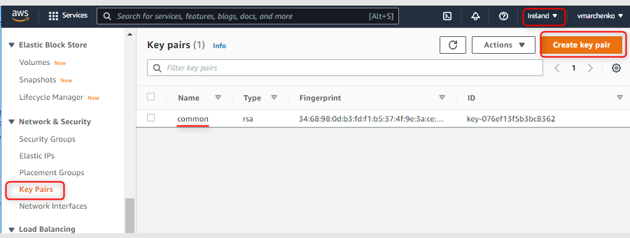

# Get Started Example {#GetStarted}

VHT Basic example demonstrates how to setup a Continuous Integration (CI) workflow for testing and debugging embedded applications using Arm Virtual Hardware (AVH). The project is maintained in the GitHub repository [**github.com/ARM-software/VHT-GetStarted**](https://github.com/ARM-software/VHT-GetStarted/) that also contains detailed description of the example.

This chapter provides step-by-step guide through the CI workflow operation and its setup.

## Overview {#GS_Overview}

The VHT Basic example implements common steps in the CI workflow as shown on the figure below and explained in subsequent sections.


1. \ref GS_DevelopTest "Local development": at first, the software is developed locally using common embedded toolchain such as [Keil MDK](https://developer.arm.com/tools-and-software/embedded/keil-mdk) and with [Arm Virtual Hardware Target (VHT)](../../simulation/html/index.html) used for MCU simulation. <br>
 A GitHub repository is used as a source code management system for synchronization, storage and version control.
2. \ref GS_SetupCI "CI pipeline setup": a GitHub Action implements the CI pipeline that gets triggered on every code update in the repository.
3. \ref GS_ExecuteCI "CI execution": automated program build and testing is performed in AVH cloud environment and results are reported back to the repository.
4. \ref GS_AnalyseFailure "Failure analysis and local debug": developer can observe the CI test results in the GitHub Actions of the repository. In case of any failures they can be reproduced and debugged locally.

## Prerequisites {#GS_Prerequisites}

Following is required to reproduce operation of the example project:

* a [GitHub](https://github.com/) account
* an [AWS](https://aws.amazon.com/) account
* a Windows PC with administrator rights

Other necessary software items are freely available and their installation is described in the related steps.

## Develop tests {#GS_DevelopTest}

The VHT Basic embedded program implements a set of unit tests for validating operation of a simple function that is expected to return the sum value of two integer arguments. The example uses [Unity Framework](https://github.com/ThrowTheSwitch/Unity) for test implementation and execution, however, the demonstrated concept is universal and can be applied for a different testing framework as well.

### Create project repository on GitHub

Initial repository setup should follow a standard git process for either [creating a new repo] (https://docs.github.com/en/get-started/quickstart/create-a-repo) or [forking](https://docs.github.com/en/get-started/quickstart/fork-a-repo) already existing one.
In this example we use a fork of the VHT GetStarted repository:
 - Open a web browser and enter the URL: [https://github.com/ARM-software/VHT-GetStarted](https://github.com/ARM-software/VHT-GetStarted)
 - Verify that you are logged in to your GitHub account.
 - Click on *Fork* (upper right side).
   - The repo gets forked into `` `https://github.com/<YourGitHubName>/VHT-GetStarted` `` repository, where ```<YourGitHubName>``` corresponds your GitHub user name.

### Setup local project folder on your PC

If the repo is present on GitHub, it can be easily copied onto local PC using following steps:
 - Make sure Git Bash is installed on the PC. For example [git for Windows] (https://gitforwindows.org/).
 - Open the Git Bash terminal in the target directory and execute clone command as:

        git clone https://github.com/<YourGitHubName>/VHT-GetStarted

### Setup Keil MDK project

 - Install Keil MDK and related tools as described in [Tools installation](../../infrastructure/html/run_mdk_pro.html#mdk_vht_install).
 - In the local project repository double-click on the _basic/basic.debug.uvprojx_ file to open the project in uVision IDE.
 - Verify the project setup as explained in [Project Configuration](../../infrastructure/html/run_mdk_pro.html#mdk_project_config).

### Implement tests locally

The _main.c_ file in the example implements a set of unit tests validating the application function ```int my_sum(int a, int b)```. The implementation relies on the [Unity Framework](https://github.com/ThrowTheSwitch/Unity) that is added to the example as a software component with the [Unity software pack](https://github.com/MDK-Packs/Pack/tree/master/Unity). In the example, the `test_my_sum_fail` demonstrates a test failure and section \ref GS_AnalyseFailure explains how to analyze CI output for debugging such failed tests. 

The implementation of tests in the example can be considered as a template for adding more tests, covering other functions, or setting up unit testing in a custom project. Please refer to the documentation in [Unity GitHub] (https://github.com/ThrowTheSwitch/Unity) for further details and more complex examples.

**Redirect stdout**

By default Unity uses `putchar` for print out. Keil MDK does not support semihosting and hence standard output needs to be redirected to become visible during debug session. [**Redirect I/O**](https://www.keil.com/pack/doc/compiler/RetargetIO/html/index.html) component enables several mechanisms for that. In our example this output gets redirected to a UART interface.

**Export project to CPRJ format**

The VHT Basic project is also described in _basic.debug.cprj_ file using universal [.cprj format](https://arm-software.github.io/CMSIS_5/Build/html/cprjFormat_pg.html) that gets used in command-line CI environments. For correct workflow operation it is important to keep the MDK project files and the _basic.debug.cprj_ file synchronized. For that after saving modifications in the MDK project go to the uVision menu [_Project_ - _Export_](https://www.keil.com/support/man/docs/uv4/uv4_ui_export.htm) and select _Save project to CPRJ format_.

**Build and Run the example in Keil MDK**

Build and execute the program in Keil MDK in the same way as any other project. Refer to [Program Build and Debug](../../infrastructure/html/run_mdk_pro.html#mdk_program_run) for additional description.

In the VHT Basic example by default the following output shall be observed in the Telnet window, indicating an intentional failure in `test_my_sum_fail`:


## CI pipeline setup {#GS_SetupCI}

As common for many projects, the CI pipeline for the VHT Get Started repository is triggered on every code change via push and pull requests. In our example this is explicitly limited to the _main_ branch only.

The CI implementation relies on [GitHub Actions](https://docs.github.com/en/actions) with [GitHub-hosted Runners](../../infrastructure/html/run_ami_github.html#GitHub_hosted). Program build and execution are done on [AVH AMI](../../infrastructure/html/index.html#AWS) instance in Amazon AWS. Custom GitHub action [Arm-Software/VHT-AMI](https://github.com/ARM-software/VHT-AMI) manages the connection between the GitHub repository and the AVH AMI instance in AWS, as well as configures the actions to be performed on the AMI.

Subsections below explain the setup for the AWS and GitHub Actions.

### AWS setup

On the AWS side several items shall be setup to enable execution of example CI pipeline on AVH AMI.

 - Enable use of AVH AMI in your AWS account with the steps described in [Subscribe Arm Virtual Hardware](../../infrastructure/html/index.html#Subscribe).
 - Provision the AWS resources required for AVH AMI operation.
  - The simplest way is explained in [AVH-AWS-Infra-CloudFormation](https://github.com/spcaipers-arm/VHT-AWS-Infra-CloudFormation) and relies on AWS CloudFormation service with the template file describing default stack configuration.
  - Alternatively, for a more customized setup see [GitHub-hosted Runners](../../infrastructure/html/run_ami_github.html#GitHub_hosted).
 - Ensure that a Key Pair is available for use with EC2.<br>
   By default the VHT Basic example expects a key pair with name `common` to create an EC2 instance (with line `ssh_key_name: common` in _basic.yml_ file).
  - In AWS Management Console type _EC2_ and go to the EC2 service.
  - In the left menu find _Network & Security_ section and click on _Key Pairs_.
  - Verify that the same AWS region is selected as will be used with AVH AMI later.
  - If no `common` key pair exists then click on _Create key pair_ button. <br>
    <br>
  - In the _Create key pair_ dialog provide `common` as _Name_. Other settings can be kept at default values.
  - Click on _Create key pair_.
  - Save the file with the private key locally when corresponding file dialog opens. <br>
    
  - Observe the created Key Pair appear in the list.

### GitHub Actions setup

Section [GitHub-hosted Runners](../../infrastructure/html/run_ami_github.html#GitHub_hosted) introdues the concept and explains it in details.

[./.github/workflows/basic.yml](https://github.com/ARM-software/VHT-GetStarted/blob/main/.github/workflows/basic.yml) file using corresponding [YAML syntax for GitHub workflows](https://docs.github.com/en/actions/learn-github-actions/workflow-syntax-for-github-actions). 

todo: explain GitHub setup

## Execute CI {#GS_ExecuteCI}

CI pipeline gets executed automatically on every code change in the _main_ branch and execution results can be observed on the repository GitHub page.

 - Go to the GitHub web-page of the repository.
 - Go to _Actions_ tab.
  - In _Workflows_ area you can see the list of GitHub workflows defined in the repository. In our example it is just one.
 - Select the workflow and its executions will be displayed on the page. An icon before the title of each run indicates whether CI pipeline execution was successfully or not. A failure indicates an issue in CI 
  -  With _Run workflow_ you can manually trigger execution of this workflow on the current codebase.
    
 - Click on the title of a workflow run to analyze its execution as explained in next section.

## Analyse Failures {#GS_AnalyseFailure}

[GitHub Documentation](https://docs.github.com/en/actions/monitoring-and-troubleshooting-workflows/about-monitoring-and-troubleshooting) gives an overview about monitoring and troubleshooting options available for GitHub Actions.

Steps below guide through the analysis for VHT Basic example.

- Observe the three CI jobs executed in the selected CI workflow as shown in the _Jobs_ area on the left side.
  - **ci_test** job executes the CI pipeline without doing any analysis of unit test results. It is considered as successful (green circle) when the CI pipeline was executed fully to the end.
  - **badge** job generates [GitHub badges](https://docs.github.com/en/actions/monitoring-and-troubleshooting-workflows/adding-a-workflow-status-badge) for the _README.md_ file to make the CI workflow status easily visible. The _badge_ job is shown as successful when badge generation worked correctly.
  - **Test results** job analyses actual results of the unit test execution in the CI. Green checkmark indicates that all executed tests pass.
  .
  By default it appears as follows:<br>

- In the _Artifacts_ area click on _results_ to download an archive file with additional details about the test run. It contains:
  - <i>basic.axf</i> binary image that was built and tested in the CI run.
  - <i>.log</i> file with program execution output.
  - <i>.xunit</i> file with unit test results.

- Click on _ci_test_ or _badge_ jobs to open corresponding [run log](https://docs.github.com/en/actions/monitoring-and-troubleshooting-workflows/using-workflow-run-logs) that can be explored for execution details. For example for _ci_test_:<br>


- Click on _Test results_ job that analyses the results of the executed tests. 
It can be seen that in default setup 1 out of 4 tests fails. Specific location (_check on line 48 in main.c_) and the reason (_Expected 2 Was 0_) for the failure are shown as well.<br>


This allows to find the failure quickly. In our example it is a trivial one, introduced on purpose in the original code.
- Return to the VHT Basic project in Keil MDK on your PC.
- Open _main.c_ file.
- In line 48 replace the incorrectly expected value `2` with the correct `0`:

        TEST_ASSERT_EQUAL_INT(0, sum);

- Rebuild the project.
- Start debug session and observe in Telnet client that all tests pass: <br>
<br>
- Although this specific change only impacts _main.c_ file, it is a good practice to also export the project to .cprj format to ensure it is synchronized with the MDK project.
- Open the Git bash in your local repository and execute following commands that upload only the updated *main.c* file to your _main_ repository:

        git commit basic/main.c -m "Fixed test_my_sum_fail"
        git push

- Go to GitHub Actions page of your repository.
- Observe that the CI workflow was automatically started with the code change. After sometime it gets completed and now the _Test results_ job shall indicate that were no test failures.<br>

