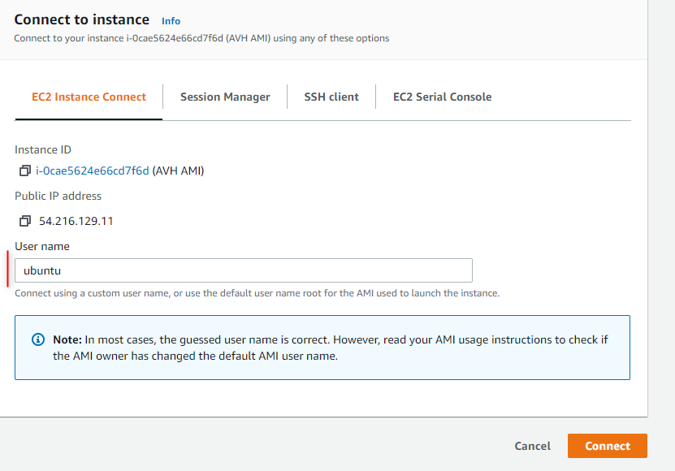

# AVH FVPs on AWS Marketplace {#AWS}

Arm provides a ready-to-use Amazon Machine Image (AMI) on AWS Marketplace. This is a Linux Virtual Machine that contains fully operational AVH FVP simulation models, compilers and useful software utilities. It gives a lot of flexibility to integrate the **Arm Virtual Hardware** in various CI/CD DevOps environments. \subpage ami_inventory gives the full list of resources available on the AVH AMI.

The following sections explain AVH AMI setup and usage in different scenarios:

  - \subpage run_ami_local describes how to setup and access the **AVH** directly from AWS Management Console.
  - \subpage run_ami_jenkins explains how to integrate the **AVH AMI** using Jenkins workflows.
  - \subpage run_ami_github explains how to integrate the **AVH AMI** in GitHub action workflows.
  - \subpage debug_ds explains how to connect to the **AVH AMI** for debug the running program with Arm DS.

## Subscribe to Arm Virtual Hardware {#Subscribe}

To use the Arm Virtual Hardware Service you first need an active AWS account. See corresponding AWS tutorial: [How do I create and activate a new AWS account?](https://aws.amazon.com/premiumsupport/knowledge-center/create-and-activate-aws-account/).

From your AWS account subscribe to Arm Virtual Hardware as follows:
  - Open [AWS Marketplace](https://aws.amazon.com/marketplace/search/results?x=24&y=20&searchTerms=Arm+Virtual+Hardware) and search for **Arm Virtual Hardware**.
  - Click on **Arm Virtual Hardware** to open the product page.
  - Click on **Continue to Subscribe** and then click **Accept Terms** to activate the subscription.

With the AVH Subscription you can now create and use AVH AMI instances.

## System Requirements {#Requirements}

**EC2 Instance type**

*c5.large* instance type is recommended to run AVH AMI. A different instance type can be also used to improve the performance.

\page run_ami_local Run AMI from AWS Console

[AWS Management Console](https://docs.aws.amazon.com/awsconsolehelpdocs/latest/gsg/learn-whats-new.html) allows you to control AWS services from a browser window and so provides a simple way to manually setup and use Arm Virtual Hardware AMI.

The key steps in this operation flow are:
- \ref Launch_ami .
- \ref connect_ami .
- \ref run_example using launched AMI instance.
-  Terminate the AMI instance once it is no longer required.

## Launch AMI Instance {#Launch_ami}

An instance of Arm Virtual Hardware AMI can be easily created in AWS Management Console as follows:
  - Login to the [AWS Management Console](https://console.aws.amazon.com/), search for **AWS Marketplace Subscriptions** and navigate to the corresponding service.
  - Find **Arm Virtual Hardware** already listed in your AWS Marketplace Subscriptions.
    - If AVH subsription is not shown, verify that your AWS account is correctly \ref Subscribe "subscribed to Arm Virtual Hardware".
  - Click on **Launch new instance** for the Arm Virtual Hardware subscription.
  - Select the initial parameters, especially important is the AWS region. Note that this page gives you access to the **Ami Id**.
  - Click on **Continue to launch through EC2** and proceed to the launch instance wizard.
  - Configure the instance parameters. Mandatory options are explained below but many other parameters can be also defined here:
   - **Instance Type**: select EC2 instance type for running AVH AMI. See \ref Requirements for information.
   - **Key Pair**: select an existing key pair or create a new one. This is required to be able to connect to the AMI instance remotely.
   - **Network Settings**: verify that VPC Id is specified here. Keep SSH connection enabled.
   - **Configure Storage**: by default 24 GiB of storage is assoticated with the AMI instance and is sufficient for most applications. However, you can specify the storage parameters here if needed.
   - Review the parameters and click **Launch Instance** to create the AVH AMI instance.
   - You should receive notification that instance was succesfully created.
   - Navigate to the EC2 service and find newly launched AVH AMI instance listed there and in having "Running" state.

## Connect to the AMI Instance {#connect_ami}

There are multiple ways to connect to the AMI instance that runs Arm Virtual Hardware. For full details refer AWS User Guide [Connect to your Linux instance](https://docs.aws.amazon.com/AWSEC2/latest/UserGuide/AccessingInstances.html).

In this section two mechanisms are described:

 - \ref use_browser "Connect from browser" explains the simplest way to access the AMI directly from a browser window.
 - \ref use_ssh "Connect Using SSH" allows you to establish remote connection to the AMI using Secure Shell protocol.


### Connect from browser {#use_browser}

For simple interaction with the AVH AMI you can run EC2 Instance Connect web-application in your browser directly from the AWS Management Console.

 - Go to **EC2 - Instances**
 - Select a running AVH AMI instance.
 - Click **Connect** (or alternatively use menu **Actions - Connect**)
 - Verify that **EC2 Instance Connect** tab is selected.
 - Specify **ubuntu** in the User Name and press **Connect**.
 - AMI Linux console opens in a new browser tab.



### Connect using SSH {#use_ssh}

To connect via the Secure Shell (SSH) client of your computer, run the following command in the terminal window:

```
$ ssh  -i <path>/your_key.pem ubuntu@<Public IPv4 DNS>
```
**Where:**
 - **ssh** is the SSH command
 - option **-i** specifies the location of the AWS private key file that has the file extension \*.pem. Shall correspond to the key pair registered with the AMI instance in \ref Launch_ami.
 - **ubuntu** is the user name of the Amazon EC2 Ubuntu Linux instance.
 - <b>\<Public IPv4 DNS\></b> is the public address typically in the format: ec2-*nn*-*nn*-*nn*-*nn*.compute-1.amazonaws.com .

Note that the **ubuntu** user by default has no password, because this is not allowed in AWS Marketplace. So initial connection requires authentication via private key file. After logging in, you can enable password authentications as follows:
 - Enable password login:
```
$ sudo sed -i '/PasswordAuthentication no/c\PasswordAuthentication yes' /etc/ssh/sshd_config
$ sudo service ssh restart
```
 - Set the password value, for example as *mypassword*:
```
$ echo "ubuntu:mypassword" | sudo chpasswd
```

Now you can login using password authentication:

```
$ ssh ubuntu@<Public IPv4 DNS>
```

and will be requested to enter the password created above (*mypassword* in this example).

In AWS Management Console you can find the instructions with SSH parameters for a specific AMI instance. Go to **EC2 - Instances**, select your instance, press  **Connect** and then select the tab **SSH client**.

Find more details in AWS help [Connect to your Linux instance using SSH](https://docs.aws.amazon.com/AWSEC2/latest/UserGuide/AccessingInstancesLinux.html).

## Run projects {#run_example}

After \ref connect_ami "connecting to the AVH AMI instance" you can copy, compile and run applications on Arm Fixed Virtual Platforms. This section shows how this can be done using the [Micro speech example](../../examples/html/MicroSpeech.html).

Copy the example code to the AMI. Since the project is available on GitHub just execute in the AMI command line:

```
$ git clone https://github.com/arm-software/AVH-TFLmicrospeech.git
```

For shared private projects your GitHub Username and Password key will be required to clone.

Navigate to the example directory:
```
$ cd ./AVH-TFLmicrospeech/Platform_FVP_Corstone_SSE-300_Ethos-U55
```
Install the necessary CMSIS Packs (you may need to change permissions for the script):
```
$ chmod 777 packlist.sh
$ ./packlist.sh
```
Note that if this generated errors, you most likely have a legacy set up. Use this command to install packs instead:
```
$ cp_install.sh packlist
```
Build the example:
```
$ cbuild.sh microspeech.Example.cprj
```
When built, you can now run the example on the FVP:
```
$ ./run_example.sh
```
The output should display similar to:
```
Fast Models [11.15.14 (Jun 23 2021)]
Copyright 2000-2021 ARM Limited.
All Rights Reserved.

telnetterminal0: Listening for serial connection on port 5000
telnetterminal1: Listening for serial connection on port 5001
telnetterminal2: Listening for serial connection on port 5002
telnetterminal5: Listening for serial connection on port 5003

    Ethos-U rev f19bc8d4 --- Apr 23 2021 13:24:11
    (C) COPYRIGHT 2019-2021 Arm Limited
    ALL RIGHTS RESERVED

Heard yes (147) @1000ms
Heard no (141) @5600ms
Heard yes (149) @9100ms
Heard no (142) @13600ms
Heard yes (149) @17100ms

Info: Simulation is stopping. Reason: Cycle limit has been exceeded.

Info: /OSCI/SystemC: Simulation stopped by user.
[warning ][main@0][01 ns] Simulation stopped by user

--- cpu_core statistics: ----------------------------------------------------
Simulated time                          : 20.000002s
User time                               : 396.865593s
System time                             : 1.924400s
Wall time                               : 398.550649s
Performance index                       : 0.05
cpu_core.cpu0                           :  10.03 MIPS (  4000000000 Inst)
----------------------------------------------------------------------------
```
## Other connections {#other}

### Enable Code Server (Visual Studio Code) {#code-server}

The Arm Virtual Hardware AMI comes with [Code Server](https://github.com/cdr/code-server), enabling access to [Visual Studio Code](https://github.com/Microsoft/vscode) with a web browser. To access it, you will need to start a SSH tunnel to the instance and forward port `8080`.

On Linux, MacOS or Windows Powershell:
```
  ssh -i <key.pem> -N -L 8080:localhost:8080 ubuntu@<AMI_IP_addr>
```

The `-N` option holds the SSH tunnel connection and does not allow to execute other remote commands. This is useful when only forwarding ports.

You can then access the IDE via a web browser on your local machine at http://localhost:8080

### Enable Virtual Network Computing (VNC) {#vnc}

VNC is a protocol to enable remote desktop. The instructions below will securely enable VNC through a SSH tunnel.

In the AMI terminal:

- Enable and set VNC password (You do not need to enter a view-only password when prompted)
```
  vncpasswd
```

- To start the VNC server for the session
```
  sudo systemctl start vncserver@1.service
```

- To restart the VNC server after reboot
```
  sudo systemctl enable vncserver@1.service
```

On your local machine:

- Forward port `5901` on local machine. On Linux, MacOS or Windows Powershell:
```
  ssh -I <key.pem> -N –L 5901:localhost:5901 ubuntu@<AMI_IP_addr>
```

The `-N` option holds the SSH tunnel connection and does not allow to execute other remote commands. This is useful when only forwarding ports.

Connect your VNC client (e.g. [Remmina](https://remmina.org), [TigerVNC](https://tigervnc.org)) to port `5901`. You will be prompted for the VNC password.
