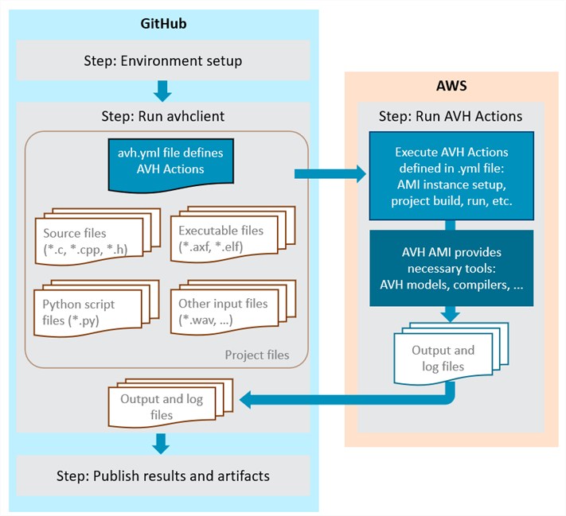
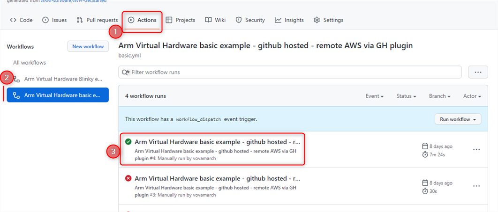

# Run AMI with GitHub Actions {#run_ami_github}

GitHub Actions help you to automate tasks within your software development life cycle. They are event-driven, meaning that you can run a series of commands after a specified event has occurred. For example, every time someone commits a push or creates a pull request for a repository branch, you can automatically trigger a job that executes automated build and run scripts on Arm Virtual Hardware. Refer to [Introduction to GitHub Actions](https://docs.github.com/en/actions/learn-github-actions/introduction-to-github-actions) for information about the components of GitHub Actions.

GitHub Actions workflow executes your commands on a Virtual Machine (GitHub Runner) that is hosted either directly by GitHub or can be self-hosted. The descriptions below refer to using GitHub-hosted Runner as a simpler way to get started with GitHub Actions.

Integration of Arm Virtual Hardware into GitHub Actions is enabled with \ref avhclient - a python module that manages remote connection, upload, build, and execution of programs on AVH AMI instances. The figure below shows a concept for a simple GitHub Action workflow that builds and tests a program on Arm Virtual Hardware.



The workflow has three main steps:

- **Step 1: Initial setup** - prepares the GitHub Runner environment.
  - This includes copying of the necessary project files; installing of required utilities such as AVH Client; provisioning of AWS parameters. etc. Explained in \ref github_add_workflow.
- **Step 2: Execute AVH Actions** - calls the *avhclient* to execute AVH Actions on AVH AMI.
  - Described in \ref github_avh_actions.
- **Step 3: Publish results**  - processes execution results.
  - This could include archiving the execution artifacts (build image, log files, etc.), publishing test results and others. Referenced in \ref github_add_workflow.

Sections below explain implementation of corresponding GitHub Action in details:
- [**Setup AWS infrastructure**](#github_aws_setup) to ensure that all resources required for running AVH Client are available.
- [**Add GitHub Action workflow**](#github_add_workflow) to your GitHub repository that implements the jobs to run on a GitHub Runner.
- [**Add GitHub Secrets**](#github_add_secrets) to your GitHub repository.
- [**Define AVH Actions**](#github_avh_actions) to be executed on the AVH AMI.

**Examples**

GitHub Actions workflow is implemented in most [**AVH reference examples**](../../examples/html/index.html). If you are not well familiar with GitHub Actions, it is recommended to start with [AVH-GetStarted example](../../examples/html/GetStarted.html) that explains the CI implementation in details.

## AWS Setup {#github_aws_setup}

The requirements to the AWS infrastructure are determined by the use of AVH Client with AWS backend. See \ref avhclient_setup_aws in AVH Client description. \ref avhclient_setup_cloudformation provides a simple way to get the necessary resources setup in AWS.

The AWS parameters obtained in this step can be then \ref github_add_secrets "stored as GitHub Secrets" and provided to the GitHub Runner environment in GitHub Actions workflow.

## Add GitHub Actions workflow {#github_add_workflow}

GitHub Actions workflows get implemented in `.github/workflows/<workflowFileName>.yml` files in the GitHub project repository. See GitHub tutorial [Using workflows](https://docs.github.com/en/actions/using-workflows) for full details.

The workflow for running a job on AVH AMI would typically be constructed as follows:

-# **Specify the events that should trigger the workflow execution.** <br/>
 For example to trigger it with each push on the main branch, as well as to enable manual start from the repository page, this would be defined as:
```
on:
  push:
    branches: [ main ]
  workflow_dispatch:
```
<br/>
-# **Set environment variables required by the workflow.** <br/>
 GitHub Secrets provide a secure way to do this for sensitive information. See \ref github_add_secrets for details. For example, if a new AMI instance shall be created for each workflow run, the mandatory AWS parameters could be assigned in the workflow yml file as follows:
```
env:
  AWS_ACCESS_KEY_ID: ${{ secrets.AWS_ACCESS_KEY_ID }}
  AWS_SECRET_ACCESS_KEY: ${{ secrets.AWS_SECRET_ACCESS_KEY }}
  AWS_DEFAULT_REGION: ${{ secrets.AWS_DEFAULT_REGION }}
  AWS_S3_BUCKET_NAME: ${{ secrets.AWS_S3_BUCKET_NAME }} 
  AWS_IAM_PROFILE: ${{ secrets.AWS_IAM_PROFILE }}
  AWS_SECURITY_GROUP_ID: ${{ secrets.AWS_SECURITY_GROUP_ID }}
  AWS_SUBNET_ID: ${{ secrets.AWS_SUBNET_ID }}
```
<br/>
-# **Define a job for running AVH Client**, including the preparation steps. Key steps are:
 - Check out repository with the target application. Standard GitHub Action is available for this.
 - Install python. Standard GitHub Action is available for this.
 - Install avhclient module. As explained in \ref avhclient_install.
 - Run AVH Client `execute` command with AWS backend. A .yml specfile shall be provided to the command, specifying the actions to be executed on AVH AMI. See \ref github_avh_actions.
 .
Implementation for such job could be as follows:
```
jobs:
  avh_run:
    runs-on: ubuntu-latest
    steps:
    - name: Check out repository code
      uses: actions/checkout@v3

    - name: Set up Python 3.10
      uses: actions/setup-python@v2
      with:
        python-version: '3.10'

    - name: Install AVH Client for Python
      run: |
        pip install git+https://github.com/ARM-software/avhclient.git@v0.1.5

    - name: Run tests
      id: avh
      run: |
        avhclient -b aws execute --specfile avh.yml
```
<br/>
-# **Process execution results.**

## Add GitHub Secrets {#github_add_secrets}

Repository-specific [GitHub Secrets](https://docs.github.com/en/actions/security-guides/encrypted-secrets) provide a useful mechanism that can be used for secure storage of sensitive AWS parameters required for running AVH Client.

The AWS environment parameters required for AVH Client are explained in \ref avhclient_setup_aws and can be can be assigned to the repository secrets without exposing their values as shown in \ref github_add_workflow. 

To create GitHub Secrets:
 - Go to the GitHub webpage of your repository.
 - Go to *Settings* tab and in the list on the left side select _Secrets_.
 - Use button _New repository secret_ and add one by required secrets.
   - Make sure that the secret names used in environment setup step in \ref github_add_workflow are in synch with the names given at this step.

Note that when repository is forked, its secrets are not copied and need to be added to the forked repository again.

Find more information in GitHub documentation: [Creating encrypted secrets for a repository](https://docs.github.com/en/actions/reference/encrypted-secrets#creating-encrypted-secrets-for-a-repository).

## Define AVH Actions {#github_avh_actions}

*AVH Actions* are the commands that get executed on the AVH AMI with AVH Client. They need to be described in a YAML specfile provided to the `avhclient execute` command. Typically the file would specify additional AWS parameters, list project files to be uploaded to the AVH AMI, describe commands to be executed, and list the files to be retrieved back. The file format is explained in \ref avhclient_yml.

Using AVH Client in a GitHub Actions workflow does not put additionally any specific requirements to the AVH Client specfile.

## Use GitHub Actions workflow {#github_use_workflow}

Once the GitHub Actions workflow is present in `.github/workflows/` directory, it will be triggered on the events defined in \ref github_add_workflow. 

The details of the specific workflow run can be observed on the GitHub repository page under *Actions*. Find more information in GitHub documentation: [Viewing the activity for a workflow run]( https://docs.github.com/en/actions/learn-github-actions/understanding-github-actions#viewing-the-activity-for-a-workflow-run).
 
For example for the [AVH-GetStarted project](../../examples/html/GetStarted.html):


