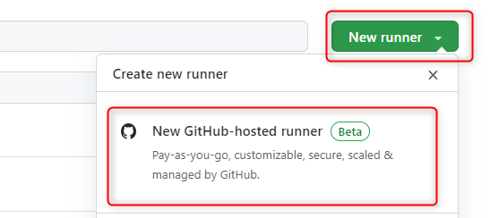
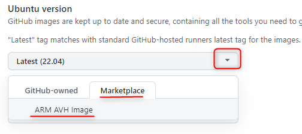
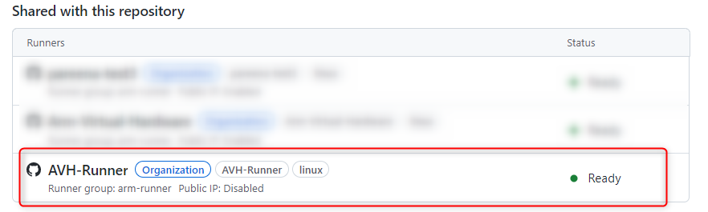

# AVH FVPs in GitHub Runner {#avh_gh}

**Arm Virtual Hardware (AVH)** is available as a GitHub-hosted Runner that greatly simplifies use of AVH for projects maintained in GitHub repositories.

AVH Runner image is a Ubuntu Linux virtual machine (VM) hosted by GitHub that contains ready-to-use Arm processor simulation models, compiler toolchains and other utilities. It natively integrates with [GitHub Actions](https://docs.github.com/en/actions) enabling simple setup of Continuous Integration (CI) workflows for building and testing embedded software projects based on Arm Cortex-M processors.

\subpage avh_gh_inventory lists the tools provided on the AVH GitHub Runner.

The following sections explain the setup of AVH GitHub Runner and its usage in different scenarios.

## Enabling AVH Runner {#avh_gh_enable}

[**Sign up to join the beta access**](https://resources.github.com/arm-gihub-actions-beta/) to Arm Virtual Hardware for GitHub Actions.

AVH GitHub Runner is available for GitHub Organization and Enterprise accounts, see [Types of GitHub Accounts](https://docs.github.com/en/get-started/learning-about-github/types-of-github-accounts).

### Adding AVH Runner {#avh_gh_adding_runner}

If the use of AVH GitHub Runner is enabled for your organization, you can create an AVH Runner as follows:

- Log into your GitHub account that has owner rights for the target GitHub organization.
- Go to your [GitHub organization settings](https://docs.github.com/en/organizations/collaborating-with-groups-in-organizations/accessing-your-organizations-settings).
- In the left sidebar click **Actions**, then click **Runners**.
- Click **New runner** and in the drop-down menu click **New GitHub-hosted runner**.<br/>
 
- In the **Name** field provide the name for the runner that later will be used by the GitHub Action.
- Make sure **Ubuntu** variant is selected as Runner image
- In the **Ubuntu version** section open the drop-down menu, switch to **Marketplace** tab and there select **Arm AVH Image**<br/>
  
- Configure other parameters for the new runner, such as **Auto-scaling**, **Runner groups** and **Networking**.
  - Note that if the runner group is not specified, then the new runner is automatically assigned to the runner group *Default* and is not available for public repositories.
- Click **Create runner**.

With an AVH Runner created in your organization, you can use the runner group to manage the access policy to the Runner from organization repositories, similar as explained in [Managing access to self-hosted runners using groups](https://docs.github.com/en/actions/hosting-your-own-runners/managing-access-to-self-hosted-runners-using-groups). By default, access needs to be enabled for each repository, but the policy can be changed to enable the runners in specific runner group for all  repositories in the organization.

### Checking AVH runner availability to a repository {#avh_gh_checking_repo}

To verrify if your AVH runner is available for a specific repository:

- Log in to GitHub with an account that has owner rights for the target repository.
- Go to the target repository and **Settings**.
- In the left sidebar click **Actions** and then **Runners**.
- See the list of runners shared with this repository and if a runner based on AVH Runner image is present with status *Ready*. Note that the runner name as well as runners group can be specific to your orgranization.<br/>
 

If the target runner is not listed, please verify that it is enabled for the organization and the repository, as described in \ref avh_gh_adding_runner.

## Using AVH Runner {#avh_gh_using_runner}

When AVH Runner is available for the target repository, you can start using it for [GitHub Action workflow jobs](https://docs.github.com/en/actions/using-workflows/about-workflows).

In the YAML file that describes the GitHub Actions workflow you can now specify the AVH Runner as the destination machine to run the job on. Use `runs-on` followed by the AVH Runner name as was provided when \ref avh_gh_adding_runner. Below is an example of such job definition:

```
jobs:
  avh_build_run:
    name: Build and Run on AVH
    runs-on: AVH-Runner

    steps:
      - name: Checkout
        uses: actions/checkout@v3
  
```

Read more about `runs-on` for specifying runners in [Choose the runner for the job](https://docs.github.com/en/actions/using-jobs/choosing-the-runner-for-a-job).

As the AVH Runner is a Ubuntu based machine, you can use many common utilities for your job. AVH-specific services are available as described in subsections below.

### Using AVH FVP models {#avh_gh_using_fvp}

[AVH simulation models](../../simulation/html/index.html) are located at `/opt/VHT/` and can be run from there using command line commands as explained in [Using Arm Fixed Virtual Platforms](../../simulation/html/using.html). 
This can be done directly in the .yaml file that specifoies the GitHub Action, or abstracted with a custom script. For example a step for running the hello.axf binary on a Cortex-M3 model can be done as a step in the GitHub Action yaml as:
```
... 
      - name: Run the example
        run: |
           /opt/VHT/VHT_MPS2_Cortex-M3  -f ./fvp-config.txt -a ./hello/out/hello/debug/avh/hello.axf --stat $*
   
```
See \subpage avh_gh_inventory for the list of models provided on the AVH GitHub Runner.

\ref avh_gh_examples demonstrate the software execution on FVP models.


### Using Compiler Toolchains {#avh_gh_using_comp}

AVH Runner includes following toolchains pre-installed and ready to use:
 - [Arm Compiler for Embedded](https://developer.arm.com/Tools%20and%20Software/Arm%20Compiler%20for%20Embedded) at `/opt/armcompiler/`
 - [Arm GNU Toolchain](https://developer.arm.com/Tools%20and%20Software/GNU%20Toolchain) at `/opt/gcc-arm-11.2-2022.02-x86_64-arm-none-eabi/`

See \subpage avh_gh_inventory for the list of toolchains provided on the AVH GitHub Runner.

## Example workflows {#avh_gh_examples}

The repository [github.com/ARM-labs](https://github.com/ARM-labs) provides several examples that use AVH runner for GitHub Actions:
 - [vscode-get-started](https://github.com/Arm-Labs/vscode-get-started) is a simple Hello World example that shows the setup. For workflow configuration see the [build.yml file](https://github.com/Arm-Labs/vscode-get-started/blob/main/.github/workflows/build.yml)
 - [AWS_MQTT_MutualAuth_Demo](https://github.com/Arm-Labs/AWS_MQTT_MutualAuth_Demo) shows an IoT example with MQTT connection to AWS. See the [avh_ci.yml file](https://github.com/Arm-Labs/AWS_MQTT_MutualAuth_Demo/blob/main/.github/workflows/avh_ci.yml) for GitHub Action flow.
 - [CMSIS-RTOS2_Validation](https://github.com/Arm-Labs/CMSIS-RTOS2_Validation) runs a GitHub Action for validating the CMSIS-RTOS2 implementations, covering different compilers, RTOS'es and CPU targets.
 
The examples are constructed with [Open-CMSIS-Pack](https://www.open-cmsis-pack.org/) support and the firmware images are built from command line using the [CMSIS-Pack development tools](https://github.com/Open-CMSIS-Pack/devtools). This simplifies support of several compiler toolchains and multiple targets.

