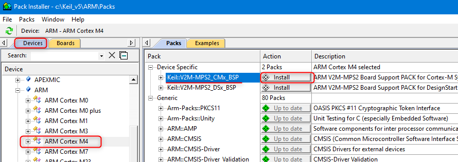
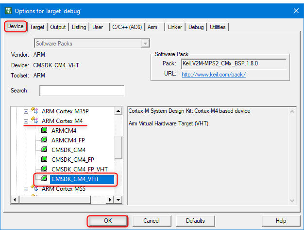
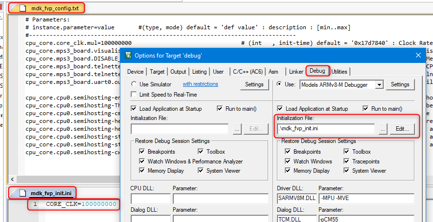

# Use with Keil µVision {#run_mdk_uv4}

This section explains how Arm FVPs can be used with
[Keil µVision](https://developer.arm.com/tools-and-software/embedded/keil-mdk) for developing and debugging embedded
applications on a local computer.

## Tools Installation {#mdk_fvp_install}

- [Download and install Keil MDK µVision](https://developer.arm.com/documentation/101407/latest/About-uVision/Installation)
  on your Windows PC, if not present yet.
- Ensure that a user-based license is activated either for the [MDK-Community](https://www.keil.arm.com/mdk-community)
  (evaluation and non-commercial use) or [MDK-Professional](https://www.keil.arm.com/keil-mdk/#mdk-v6-editions)
  (commercial use) editions. This is required for running Arm FVP models.
- [*Optional*] Enable Telnet Client on Windows 10. This will allow to observe UART output from the AVH device during
  debug.
    - Open **Start > Settings**.
    - In the search box, type **Turn Windows features on or off** and click on the suggested item. The
      **Windows Features** dialog opens.
    - Select the **Telnet Client** check box and click **OK**. The installation might take several minutes to complete.

## Project Configuration {#mdk_uv4_project_config}

Two important configuration areas need special attention in µVision projects for Arm FVPs:

- \ref mdk_uv4_fvp_targets in the project. This is required for new projects or when changing the target device in an
  existing project.
- \ref mdk_uv4_fvp_debug in the project. This step is typically needed for setting up any project, but with reference
  examples brief verification of the default settings can be sufficient.

### Target selection {#mdk_uv4_fvp_targets}

Device support for Arm FVP targets is implemented with the same CMSIS principles as used for real hardware devices.
[CMSIS-based projects for Arm FVPs](../../simulation/html/avh_fvp_cmsis.html) lists the device family packs and BSP
packs required for use with Arm FVPs.

When opening an existing project, you will be asked if any missing packs required by the project shall be installed. If
you agree to that, also the necessary pack with device definition for the target device used in the project will be
automatically installed.

When creating a new project or when changing the target in an existing project you need to select an FVP target as follows:

- Install the CMSIS-Pack with target device definition, if not present yet:
    - Start [*Pack Installer*](https://developer.arm.com/documentation/101407/latest/Creating-Applications/Software-Components/Pack-Installer)
      utility.
    - In *Devices* tab expand *ARM* section and select the target Cortex-M core.
    - In the [*Packs*](https://developer.arm.com/documentation/101407/latest/Creating-Applications/Software-Components/Pack-Installer/Packs-Dialog)
      tab under *Device Specific* category select the target CMSIS-Pack that implements the required device according
      to the table in [CMSIS-based projects for Arm FVPs](../../simulation/html/avh_fvp_cmsis.html).
    - Press *Install* or *Update* button in the Action field to get the latest version installed. For example for Arm
      Cortex-M4: 
      
    - Observe the button status changed to *Up to date* and return to the project in µVision.
- Select AVH device as the target in your project:
    - In the project open *Options for target...* dialog and select *Device* tab.
    - In the list of device vendors expand *ARM* group.
    - Expand the group of your target Cortex-M core.
    - In the list select the target device according to the table in
      [CMSIS-based projects for Arm FVPs](../../simulation/html/avh_fvp_cmsis.html) and press *OK*. For example for Arm
      Cortex-M4: 
      

### Run and debug configuration {#mdk_uv4_fvp_debug}

Configure execution and debug of an µVision project on an Arm FVP model using the steps explained in the
[Debug Driver Coviguration](https://developer.arm.com/documentation/101407/latest/Simulation/AVH-FVP-Targets/Debug-Driver-Configuration)
for Arm FVP targets.

- In the **Debug** tab, in the **Initilization File** field, use the ... button to provide a path to a file that
  assigns `CORE_CLK` to the same value as specified for the `core_clk.mul` parameter in the model configuration file.
  This ensures that the timing for µVision displays is correctly calculated in synch with the simulation. **Edit**
  button can be used to view and modify the file in the µVision editor. Figure below shows the example configuration
  and content of the files used, *mdk_fvp_config.txt* and *mdk_fvp_init.ini*: 
  

## Program Build and Debug {#mdk_uv4_program_run}

Project build and debug on an Arm FVP target can be done in the similar way as any other Keil µVision project:

- Press _Rebuild_ button in µVision toolbar (or use `F7` hotkey).
- Start the debug session from µVision toolbar (or with `Ctrl-F5`). The model executable window should pop up (with
  `C:\WINDOWS\system32\cmd.exe`) but it will stay empty during the session.
- If enabled in \ref mdk_uv4_fvp_debug, a Telnet client will start. Program output should be expected there.
- Debug the project as usual with available µVision functionality. Refer to
  [Application Debug on Arm FVPs](https://developer.arm.com/documentation/101407/0540/Simulation/AVH-FVP-Targets/Application-Debug)
  for additional details and references.

## Using csolution projects {#mdk_uv4_csolution}

Projects in universal
[csolution format](https://github.com/Open-CMSIS-Pack/cmsis-toolbox/blob/main/docs/YML-Input-Format.md) can be opened
in Keil MDK µVision for debugging. See notes about "Open Project..." item in the
[Project Menu and Commands](https://developer.arm.com/documentation/101407/0540/User-Interface/Project-Menu-and-Commands).

You can also export the µVision project go to the csolution format by choosing menu
[**Project - Export**](https://developer.arm.com/documentation/101407/latest/User-Interface/Project-Menu-and-Commands/Export-Menu)
and select **Save project to csolution format**.
