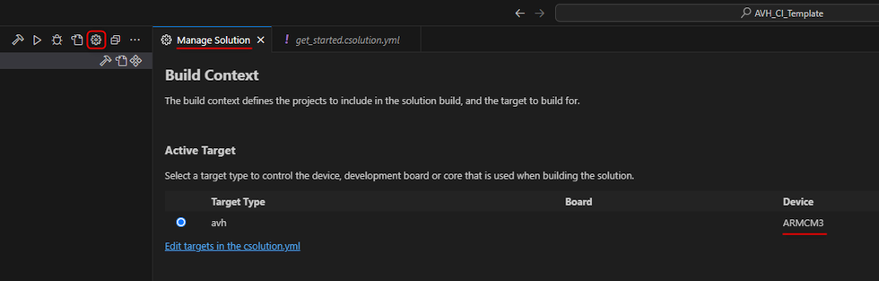

# Use with Keil Studio {#run_mdk_vscode}

This section explains how Arm Fixed Virtual Platforms (FVP) can be used with [Keil Studio for VS Code (MDK v6)](https://www.keil.arm.com) for developing and debugging embedded applications on a local computer.

## Tools Installation {#mdk_vscode_install}

 - Download and Install [Visual Studio Code](https://code.visualstudio.com/) if not installed yet.
 - Install [Arm Keil Studio Pack](https://developer.arm.com/documentation/109350/latest/Installation/Keil-Studio-installation) in Visual Studio Code.
 - Ensure that a user-based license is [activated](https://developer.arm.com/documentation/108029/latest/Activate-your-license-to-use-Arm-tools). Either a [Keil MDK-Community edition](https://www.keil.arm.com/mdk-community) (evaluation and non-commercial use) or an [MDK-Professional](https://www.keil.arm.com/keil-mdk/#mdk-v6-editions) (commercial use) is required for running AVH FVP models.

## Target selection {#mdk_vscode_fvp_targets}

Keil Studio natively supports the [Open-CMSIS-Pack format](https://www.open-cmsis-pack.org/) for device support and management of software components. See [CMSIS-based projects for AVH FVPs](../../simulation/html/avh_fvp_cmsis.html) for the list of the device family packs and BSP packs required for use with AVH FVPs.

 - When opening an existing [csolution project](https://github.com/Open-CMSIS-Pack/cmsis-toolbox/blob/main/docs/YML-Input-Format.md) in Keil Studio, all necessary packs for the target will be automatically installed.
.
 - When creating a new solution you need to select a target device that correponds to the AVH FVP model according to the table in [CMSIS-based projects for AVH FVPs](../../simulation/html/avh_fvp_cmsis.html). Follow the instructions provided in [Create a new solution using the Keil Studio VS Code extensions](https://developer.arm.com/documentation/109350/v6/Create-new-applications/Create-a-new-solution-using-the-Keil-Studio-VS-Code-extensions).
.

You can view the device name defined for the target in the project csolution.yml file, or by clicking the *Manage solution settings* button in the CMSIS view, as shown on the image below. [Set a context for your solution](https://developer.arm.com/documentation/108029/latest/Arm-CMSIS-Solution-extension/Set-a-context-for-your-solution) explains the concept in details.

 


## vcpkg configuration {#mdk_vscode_vcpkg}

Keil Studio relies on [Arm Environment Manager extension](https://developer.arm.com/documentation/108029/latest/Arm-Environment-Manager-extension) to setup development environment from Arm Tools Artifactory using Microsoft vcpkg. The vcpkg manifest file `vcpkg_configuration.json` shall contain the requirement for AVH FVPs models, in the same way as explained in \ref avh_fvp_vcpkg. For example:

```
{
  "registries": [
    {
      "name": "arm"
      "kind": "artifact",
      "location": "https://artifacts.tools.arm.com/vcpkg-registry"
    }
  ],
  "requires": {
    "arm:models/arm/avh-fvp": "^11.27.31"
  }
}
```

Note that in Keil Studio also other artifacts are usually present for build and debug tasks such as cmsis-toolbox, compiler toolchain, and others.

## Program Build {#mdk_vscode_build}

Follow the instructions provided in the [Build the example project](https://developer.arm.com/documentation/108029/0000/Get-started-with-an-example-project/Build-the-example-project) in the Arm Keil Studio for VS Code User's Guide.


## Program Run and Debug {#mdk_vscode_program_run}

In Keil Studio you can run a program on the target without using the debugger. See [Run the solution](https://developer.arm.com/documentation/109350/latest/Create-new-applications/Create-a-new-solution-using-the-Keil-Studio-VS-Code-extensions/Run-the-solution) for steps how to configure corresponding task for AVH FVPs.

To be able to debug your program, you must create a corresponding launch configuration, as explained in [Debug the solution](https://developer.arm.com/documentation/109350/v6/Create-new-applications/Create-a-new-solution-using-the-Keil-Studio-VS-Code-extensions/Debug-the-solution).
