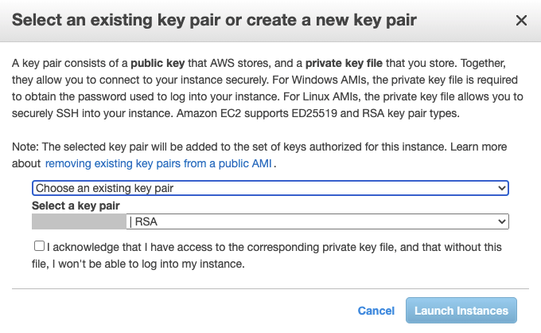
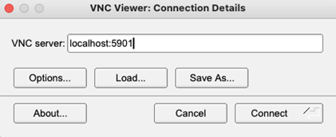

# Run AMI on local computer {#run_ami_local}

This section describes how to run the **AMI with \prj_name** on a local computer and assumes that have setup the \ref AWS.

\note
   Refer to \ref mainpage for others ways to use the \prj_name.

There are two was to launch the AMI:
  - \ref Launch_website gives direct access. 
  - \ref Launch_EC2 gives you more control over the EC2 instance and is more flexible.
  
Once the AMI is launched you may \ref connect.

\note
  Terminate the AMI instance once it is no longer required.
  


## Launch from Website {#Launch_website}

Before you can launch from a Website you should create a **VPC** and a **key pair**. 

Choose the following settings:
  - **EC2 Instance Type:** *t3.medium* is sufficient to run \prj_name. An instance with more resources may improve performance.
  - **VPC Settings:** select the VPC settings for the EC2 instance.
  - **Key Pair Settings:** select your key.
  
  
## Launch trough EC2 {#Launch_EC2}

The following steps launch the **\prj_name AMI** from the AWS Console:

 1. **Choose AMI:** Select the **\prj_name** and click **Launch** (skip this step when you launch from marketplace).


 2. **Choose an Instance Type:** Select *t3.medium* (2 vCPUs, 4 GiB memory) is recommended. An instance with more resources may improve performance. 


 3. **Configure Instance Details:** Under Network select a VPC. Note: a public IP address is required for SSH access.  


 4. **Add Storage:** The default storage 24 GiB is sufficient for most applications. Optionally, this can be increased if needed. 


 5. **Add Tags:** This is optional, however adding the **Key=Name** with a meaningful **Value** helps you to identify the EC2 instance.


 6. **Configure Security Group:** Set Type: SSH, Protocol: TCP, Port Range: 22, Source: My IP (or Anywhere) to allow access from your IP address.

 
 7. **Review Instance Launch:** allows you to verify the setup.  Then click **Launch**


You may then select an existing key pair or create a new key pair. When an existing key pair is selected, confirm in the dialog the check box *I acknowledge...*. To finally start, click **Launch Instances**.



# Connect to the EC2 Instance {#connect}

There are multiple ways to connect to the Amazon EC2 Linux instance that runs Arm VHT. For more information refer to:
  - [Connect to your Linux instance](https://docs.aws.amazon.com/AWSEC2/latest/UserGuide/AccessingInstances.html?icmpid=docs_ec2_console)

## Using SSH {#use_ssh}

The connect via the Secure Shell (SSH) client of your computer, use the following command:

```
$ ssh  -i <path>/your_key.pem ubuntu@<Public IPv4 DNS>
```
**Where:**
 - **ssh** is the SSH command
 - option **-i** specifies the location of the AWS private key file that has the file extension \*.pem.
 - **ubuntu** is the user name of the Amazon EC2 Ubuntu Linux instance.
 - **\<Public IPv4 DNS\>** is the public address typically in the format: ec2-*nn*-*nn*-*nn*-*nn*.compute-1.amazonaws.com

You can review this details also under the AWS EC2 Management Console under **EC2 - Instances - \<select instance\> - Connect** and then select the tab **SSH Client**.

## Using VNC {#use_vnc}

Some applications may require a display. [Virtual Network Computing](https://de.wikipedia.org/wiki/Virtual_Network_Computing) (VNC) is available in the Arm VHT AMI and can be used as a remote desktop.

First, setup VNC password.
```
$ vncpasswd 0 i - 
```
When prompted, enter a password. A read-only password is not required.

To start VNC every time the machine is rebooted enable it to start on boot:
```
$ sudo systemctl enable vncserver@1.service
```
To start VNC now (1 time, without rebooting) use:
```
$ sudo systemctl start vncserver@1.service
```
To disable VNC from running on future machine restarts run:
```
$ sudo systemctl disable vncserver@1.service
```
To stop VNC now use:
```
$ sudo systemctl stop vncserver@1.service
```
If VNC is running on the EC2 instance a VNC client can be used to connect. The easiest way to connect is by forwarding the VNC port using ssh. With this technique no additional ports need to be opened in the EC2 security group. 

To connect use SSH port forwarding to avoid opening any other ports in the AWS security group
```
$ ssh -i /path/to/aws.pem -L 5901:localhost:5901 ubuntu@@<EC2-IP-addr>
```

Open a VNC viewer, such as TigerVNC. Enter the VNC server as localhost:5901 and click Connect. It should ask for the previously set password and then present a remote desktop.




## Using Code Server  {#use_code_server}

Code Server is automatically running on the AMI on port 8080. To connect use port forwarding to ssh into the EC2 instance.
```
$ ssh -i /path/to/aws.pem -L 8080:localhost:8080 ubuntu@@<EC2-IP-addr>
```
Using a local browser connect to http://localhost:8080 and you should see Visual Studio Code appear in the browser. 


# Running Micro Speech  {#run_example}

Run the micro speech example. Connect to the EC2 instance using ssh as described above and then get the example, compile, and run.
```
$ git clone https://github.com/arm-software/VHT-TFLmicrospeech.git
```

For shared private projects your GitHub Username and Password key will be required to clone.

```
$ cd ./VHT-TFLmicrospeech/Platform_FVP_Corstone_SSE-300_Ethos-U55

$ cp_install.sh packlist

$ cbuild.sh microspeech.Example.cprj

$ ./run_example.sh
```


The output should display:

```
Fast Models [11.15.14 (Jun 23 2021)]
Copyright 2000-2021 ARM Limited.
All Rights Reserved.

telnetterminal0: Listening for serial connection on port 5000
telnetterminal1: Listening for serial connection on port 5001
telnetterminal2: Listening for serial connection on port 5002
telnetterminal5: Listening for serial connection on port 5003

    Ethos-U rev f19bc8d4 --- Apr 23 2021 13:24:11
    (C) COPYRIGHT 2019-2021 Arm Limited
    ALL RIGHTS RESERVED

Heard yes (147) @1000ms
Heard no (141) @5600ms
Heard yes (149) @9100ms
Heard no (142) @13600ms
Heard yes (149) @17100ms

Info: Simulation is stopping. Reason: Cycle limit has been exceeded.

Info: /OSCI/SystemC: Simulation stopped by user.
[warning ][main@0][01 ns] Simulation stopped by user

--- cpu_core statistics: ----------------------------------------------------
Simulated time                          : 20.000002s
User time                               : 396.865593s
System time                             : 1.924400s
Wall time                               : 398.550649s
Performance index                       : 0.05
cpu_core.cpu0                           :  10.03 MIPS (  4000000000 Inst)
----------------------------------------------------------------------------
```


