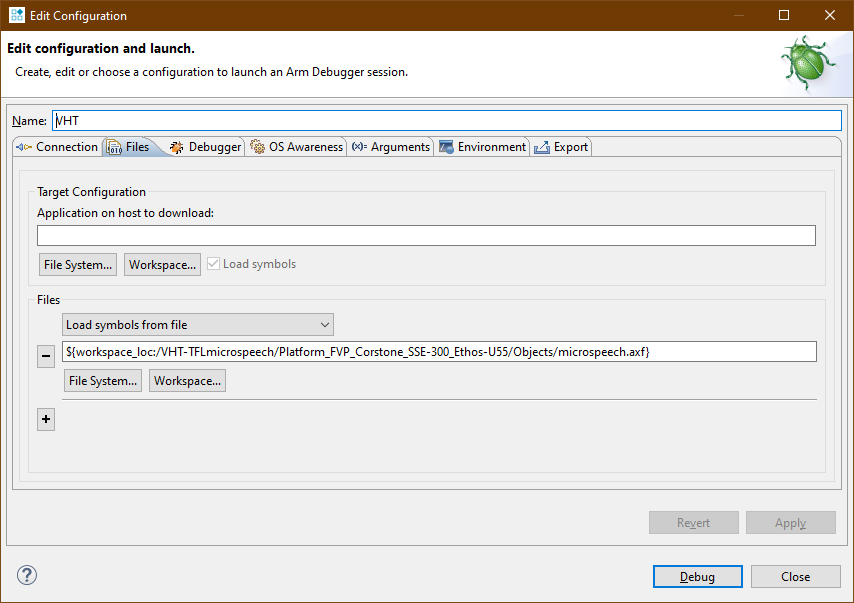

# Debug with Arm Development Studio {#debug_ds}

This section explains how Virtual Hardware Targets can be used [Arm Development Studio](https://developer.arm.com/tools-and-software/embedded/arm-development-studio) for debugging your embedded application on a local computer.

## Tools Installation and set up {#ds_setup}

- [Download](https://developer.arm.com/tools-and-software/embedded/arm-development-studio/downloads) and install the latest Arm Development Studio. If necessary, you can generate an evaluation license from _Help > Arm License Manager_.

- Use SSH port forwarding to forward the port to be used for debug server (default is `7100`) on your virtual target to your localhost. See similar instructions [here](https://arm-software.github.io/VHT/main/infrastructure/html/run_ami_local.html#use_vnc).

## Start Virtual Hardware Target {#ds_vht_start}

- Add following [command line options](../../simulation/html/Using.html#Options) when launching a program on the virtual target in the AMI:
|**Option**             |**Alias**|
| ----------------------| ------- |
| `--iris-server`       | `-I`    |
| `--iris-allow-remote` | `-A`    |
| `--iris-port <PORT>`  |         |
| `--print-port-number` | `-p`    |

**Example**

```
VHT-Corstone-300.exe <other launching options> -I -A --iris-port 7100 -p
```

This will start the debug server with remote connection enabled on port 7100.

## Connect to Target in Arm DS {#ds_connect}

- From the menu, select _File > New > Model Connection_, and give the connection a meaningful name
- Search for `VHT` to show all supported Virtual Hardware Targets, and select appropriate target
- In the _Connections_ tab, specify to connect to an already running model at `localhost:<port>`<br>


- In the _Files_ tab, specify the local ELF image to load debug symbols from<br>


- Click _Debug_ to connect to the virtual target, and commence your debug session

For more information see the Arm Development Studio [documentation](https://developer.arm.com/documentation/101469/latest/Debugging-code/Configuring-a-connection-to-an-external-Fixed-Virtual-Platform--FVP--for-bare-metal-application-debug).
