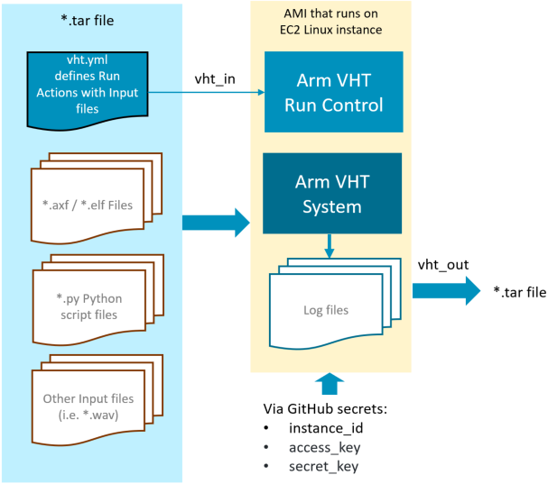

# Run AMI with GitHub Actions {#run_ami_github}

GitHub Actions help you automate tasks within your software development life cycle. GitHub Actions are event-driven, meaning that you can run a series of commands after a specified event has occurred.  For example, every time someone commits a push or creates a pull request for a repository, you can automatically run the Arm VHT Services that execute automated build or test scripts. Refer to [Introduction to GitHub Actions](https://docs.github.com/en/actions/learn-github-actions/introduction-to-github-actions) for information about the components of GitHub Actions.

There are several different ways to execute GitHub Actions:
  - [**Self-hosted GitHub runners**](./#self_hosted) where the complete GitHub Action is executed on an AWS EC2 Linux instance.
  - [**GitHub-hosted runners**](./#GitHub_hosted) where only a part of the GitHub Action (for example testing) is executed on an AWS EC2 Linux instance.
  
The approach that you should choose depends on your CI/CD requirements.

# Self-hosted GitHub Runners {#self_hosted}

The following steps explain how to use **self-hosted GitHub runners** with [AWS Marketplace: \prj_name](https://aws.amazon.com/marketplace/search/results?searchTerms=Arm+Virtual+Hardware).

  1. [**Configure GitHub Actions**](#self-hosted1) and obtain the *download* and *configuration* scripts.
  2. [**Start AMI Console**](#self-hosted2) and copy the *download* and *configuration* scripts.
  3. [**Setup runner on AMI**](#self-hosted3) to your GitHub repository and configure it for your requirements.
  4. [**Test GitHub Action**](#test_action) to verify that it performs as expected.
  
Once this steps are completed, any commit or pull request to the repository should trigger the *CI* workflow that you have defined.
  
  
## Setup AWS EC2 Instance {#setup_AWS}

 - Subscribe to the [AWS Marketplace: \prj_name](https://aws.amazon.com/marketplace/search/results?searchTerms=Arm+Virtual+Hardware)
 - What are the steps to configure/setup the \prj_name?

## Add GitHub Secrets {#add_secrets}

 - What/how to setup secrets? 

## Add GitHub Action {#add_action}

 - How is the EC2 instance started/stopped?  What effect to charging has this?

 - What are the steps to add the GitHub action?

```
# This is a sample workflow for projects that use CMSIS-Build

name: Arm Virtual Hardware example

on:
  push:
    branches: [ main ]
  pull_request:
    branches: [ main ]

# To allow you to run this workflow manually from the GitHub Actions tab add
  workflow_dispatch:

jobs:
  ci_demonstration:
    runs-on: self-hosted
    env:
      working-directory: ${{ github.workspace }}/Platform_FVP_Corstone_SSE-300_Ethos-U55/
    steps:
      - name: Check out repository code
        uses: actions/checkout@v2

      - name: What has been cloned?
        run: echo "${{ github.repository }} has been cloned."

      - name: Get dependencies
        run: cp_install.sh packlist
        working-directory: ${{env.working-directory}}

      - name: Build the micro_speech example
        run: cbuild.sh microspeech.Example.cprj
        working-directory: ${{env.working-directory}}

      - name: Run the micro_speech example
        run: ./run_example.sh
        working-directory: ${{env.working-directory}}
```


## Test GitHub Action

Once this GitHub action is deployed, it may be manually tested.

Describe the steps, i.e to start https://github.com/MDK-Packs/VHT-TFLmicrospeech/actions


# GitHub-hosted Runners {#GitHub_hosted}


The following steps explain how to use **GitHub-hosted runners** with [AWS Marketplace: \prj_name](https://aws.amazon.com/marketplace/pp/prodview-urbpq7yo5va7g).

  1. [**Setup AWS EC2 Instance**](#setup_AWS) and obtain the *access information*.
  2. [**Add GitHub Secrets**](#add_secrets) with the *access information* to your GitHub repository with gives access to the AWS EC2 instance.
  3. [**Add GitHub Action**](#add_action) to your GitHub repository and configure it for your requirements.
  4. [**Test GitHub Action**](#test_action) to verify that it performs as expected.
  
Once this steps are completed, any commit or pull request to the repository should trigger the *CI* workflow that you have defined.

An \ref AWS "Amazon Machine Image (AMI)" provides a complete tool installation that can be integrated with GitHub Actions.
To simplify integration the [Arm \prj_name - GitHub Action](https://github.com/ARM-software/VHT-AMI) can be integrated into GitHub jobs. This action manages connection, upload and execution of a test suite on Amazon EC2 Linux instance that runs an \ref AWS "Arm VHT AMI".



The VHT-AMI action receives a *.tar input file (vht_in) that contains the vht.yml control file. The vht.yml is the run control commands for the AMI and defines the execution of build scripts or test runs. Once the AMI run control commands are complete the results are returned as *.tar file to the GitHub runner.

The file [action.yml](https://github.com/ARM-software/VHT-AMI/blob/master/action.yml) defines the parameters for the GitHub action.


## AWS Account Setup
The following AWS account requirements are needed to run VHT-AMI action.

### Create PassRole policy for VHT-AMI
You need to create a PassRole IAM policy to be attached to our IAM User with the following content.
You can name it `vht-passrole`.
```json
{
    "Version": "2012-10-17",
    "Statement": [
        {
            "Effect": "Allow",
            "Action": "iam:PassRole",
            "Resource": "*"
        }
    ]
}
```

More info: [Create IAM Policy](https://docs.aws.amazon.com/IAM/latest/UserGuide/access_policies_create-console.html)

### Create Identity and Access Management (IAM) User
You have to create an IAM User to limit resource permission to your CI. In addition, the IAM User provides fixed `AWS Access Key Id` and `AWS Secret access key` values.
For this user, you have to add the following `policies`:
- vht-passrole (created before)
- AmazonEC2FullAccess (AWS managed policy --> It already exists in your account)
- AmazonS3FullAccess (AWS managed policy --> It already exists in your account)
- AmazonSSMFullAccess (AWS managed policy --> It already exists in your account)

You also need to add the following `Permission boundary`:
- PowerUserAccess

The user can be called `vht`.

More info: [Create IAM User](https://docs.aws.amazon.com/IAM/latest/UserGuide/id_users_create.html)

### Create an IAM Role For EC2 Services
You have to create IAM Role to be attached to the EC2 Instances. This role gives EC2 Instances access to S3 buckets and SSM services.
For this role, you have to add the following `policies`:
- AmazonS3FullAccess
- AmazonSSMFullAccess

You also need to add the following `Permission boundary`:
- PowerUserAccess

More info: [Create IAM Role For Service](https://docs.aws.amazon.com/IAM/latest/UserGuide/id_roles_create_for-service.html)

## Usage

You can now consume the action by referencing the v1 branch

```
uses: Arm-Software/VHT-AMI@v1
with:
  vht_in:
  instance_id: ${{ secrets.AWS_INSTANCE_ID }}
  access_key_id: ${{ secrets.AWS_ACCESS_KEY_ID }}
  secret_key_id: ${{ secrets.AWS_SECRET_KEY }}
  aws_region: "eu-west-1"
  s3_bucket_name: my_bucket
```

**Where**

 - *secrets.AWS_INSTANCE_ID* is the instance ID of the AMI stored as GitHub secret.

 - *secrets.AWS_ACCESS_KEY_ID* is the access key to AMI stored as GitHub secret.

 - *secrets.AWS_SECRET_KEY* is the secret key to AMI stored as GitHub secret.

 - aws_region: name of the region your EC2 and S3 instances are located

 - s3_bucket_name: for temporary storage an S3 bucket is used

Refer to [Creating encrypted secrets for a repository](https://docs.github.com/en/actions/reference/encrypted-secrets#creating-encrypted-secrets-for-a-repository) for storing the AMI access information.

