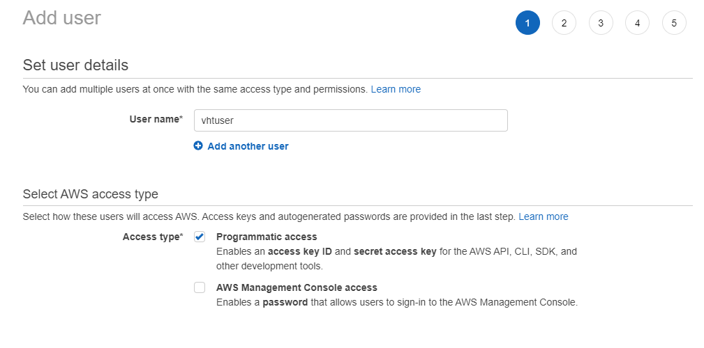
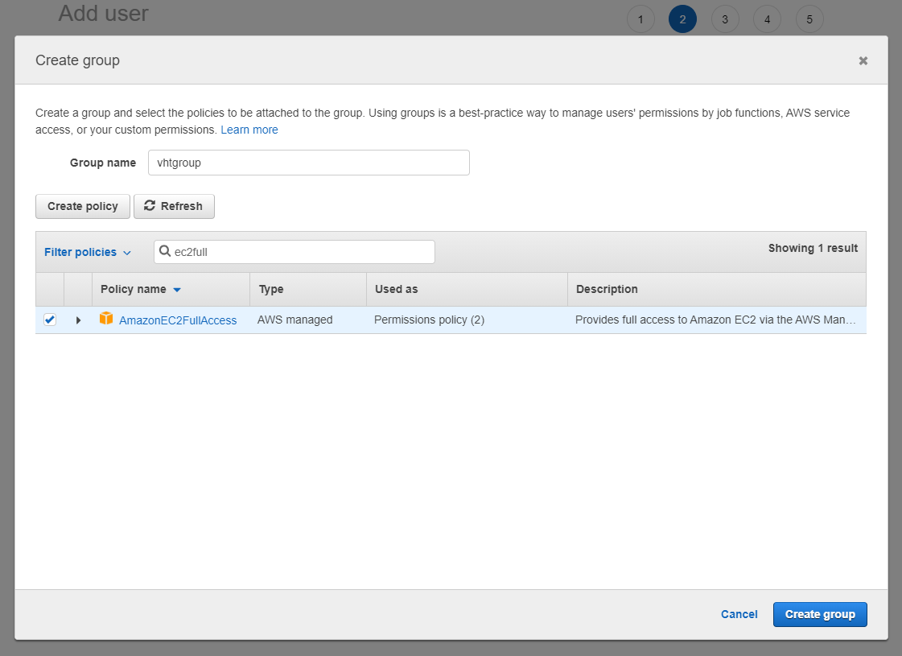
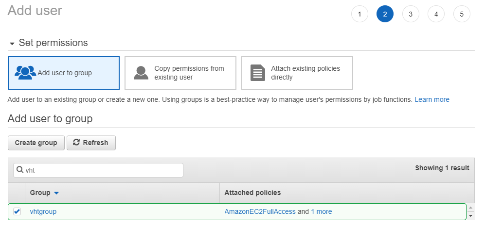

# Using Arm VHT with GitHub Actions {#vht_github}

GitHub Actions help you automate tasks within your software development life cycle. GitHub Actions are event-driven, meaning that you can run a series of commands after a specified event has occurred.  For example, every time someone commits a push or creates a pull request for a repository, you can automatically run the Arm VHT Services that execute automated build or test scripts. Refer to [Introduction to GitHub Actions](https://docs.github.com/en/actions/learn-github-actions/introduction-to-github-actions) for information about the components of GitHub Actions.

An \ref vht_aws "Amazon Machine Image (AMI)" provides a complete tool installation that can be integrated with GitHub Actions.
To simplify integration the [Arm \prj_name - GitHub Action](https://github.com/ARM-software/VHT-AMI) can be integrated into GitHub jobs. This action manages connection, upload and execution of a test suite on Amazon EC2 Linux instance that runs an \ref vht_aws "Arm VHT AMI".


The VHT-AMI action receives a *.tar input file (vht_in) that contains the vht.yml control file. The vht.yml is the run control commands for the AMI and defines the execution of build scripts or test runs. Once the AMI run control commands are complete the results are returned as *.tar file to the GitHub runner.

The file [action.yml](https://github.com/ARM-software/VHT-AMI/blob/master/action.yml) defines the parameters for the GitHub action.


# Configure the Arm VHT AMI

The next few steps are required to install the agent and configure a dedicated SSH access for file transfers on the AMI instance.


 1. **Create IAM role:** Access the AWS console and select **IAM** from the selection of services. Go to **Users** and **Add users**

 2. Choose an name for your new user and allow **Programmatic access**
 
 
 3. Add a permission group and add the policies for *AmazonEC2FullAccess* and *AmazonSSMFullAccess*
 

 4. Select the newly created group and continue.
 

 5. Continue with default settings through the rest of the steps.

 6. Connect to the instance via SSH console and enter following commands:
    - cd /home/ubuntu
    - mkdir vhtwork && mkdir vhtagent
    - cd vhtengine
    - wget https://github.com/ARM-software/VHT-AMI/blob/master/agent/process_vht.py
    - ssh-keygen -t rsa -b 2048 -f github.pem -N "" 
    - cat github.pem.pub >> ~/.ssh/authorized_keys

 7. Create an instance profile as documented on https://docs.aws.amazon.com/systems-manager/latest/userguide/setup-instance-profile.html

 8. Add the secrets as documented in the Usage section.
  

 9. Add vht.yml to your repostitory, at the location specified by avt_in.


## Usage

You can now consume the action by referencing the v1 branch

```
uses: Arm-Software/VHT-AMI@v1
with:
  vht_in:
  instance_id: ${{ secrets.AWS_INSTANCE_ID }}
  access_key_id: ${{ secrets.AWS_ACCESS_KEY_ID }}
  secret_key_id: ${{ secrets.AWS_SECRET_KEY }}
```

**Where**

 - *secrets.AWS_INSTANCE_ID* is the instance ID of the AMI stored as GitHub secret.

 - *secrets.AWS_ACCESS_KEY_ID* is the access key to AMI stored as GitHub secret.

 - *secrets.AWS_SECRET_KEY* is the secret key to AMI stored as GitHub secret.

Refer to [Creating encrypted secrets for a repository](https://docs.github.com/en/actions/reference/encrypted-secrets#creating-encrypted-secrets-for-a-repository) for storing the AMI access information.

