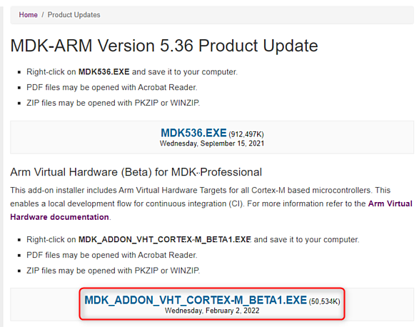

# Run with MDK-Professional {#run_mdk_pro}

This section explains how Virtual Hardware Targets can be used with [Keil MDK](https://developer.arm.com/tools-and-software/embedded/keil-mdk) tools for developing and debugging your embedded application on a local computer.

## Tools Installation {#mdk_vht_install}

 - [Download Keil MDK](https://www.keil.com/demo/eval/arm.htm) and install it on your Windows PC, if not present yet.
 - Ensure that [MDK-Professional Edition](https://developer.arm.com/tools-and-software/embedded/keil-mdk/buy) is activated in MDK as this is required for running VHTs. If MDK-Professional license is not available, you can [request an evaluation license](https://www.keil.com/support/man/docs/license/license_eval.htm).
 - Download the MDK AddOn with the Virtual Hardware Targets:
  - Go to [https://www.keil.com/update/sw/mdk/5.36](https://www.keil.com/update/sw/mdk/5.36)
  - Fill in the form on the page and click Submit button. Note that you need to provide the LIC/PSN of your MDK-Professional license.
  - Click on the *MDK_ADDON_VHT_CORTEX-M_BETA1.EXE* link and save the AddOn installer file to your PC.
  .
  
 - Install the MDK VHT AddOn:
  - Double-click on the AddOn installer file and follow the installation steps.
   - As *Destination Folder* it is recommended to use the Keil MDK installation directory (for example `C:/Keil_v5/`). Many example projects are configured to use this path by default.
  - After installation is completed, check that the destination folder now contains _ARM/VHT/_ directory, for example `C:/Keil_v5/ARM/VHT/`.
 - [*Optional*] Enable Telnet Client on Windows 10. This will allow to observe UART output from the VHT during debug.
   - Open _Start_ > _Settings_.
   - In the search box, type _Turn Windows features on or off_ and click on the suggested item. The _Windows Features_ dialog opens.
   - Select the _Telnet Client_ check box and click _OK_. The installation might take several minutes to
complete.
   .
   

## Project Configuration {#mdk_project_config}

Two important configuration areas need special attention in MDK projects for Arm VHT:
 - \ref mdk_vht_targets in the project. This is required for new projects or when changing the target device in an existing project.
 - \ref mdk_vht_debug in the project. This step is typically needed for setting up any project, but with reference examples brief verification of the default settings can be sufficient.

Table below lists the Cortex-M cores supported with Arm VHTs, corresponding VHT device names to be used in \ref mdk_vht_targets, the CMSIS Pack with device support, as well as simulation models to be selected in \ref mdk_vht_debug.

Arm Cortex-M Core | VHT Device Name     | CMSIS Pack with the VHT Device        | VHT launch command in MDK 1 |   Description
:-----------------|:--------------------|:--------------------------------------|:---------------------------------------|:-------------------------------
Cortex-M0         | CMSDK_CM0_VHT       | Keil.V2M-MPS2_CMx_BSP from v1.8.0     | VHT_MPS2_Cortex-M0_MDK.exe     | Arm VHT device with Cortex-M0 core
Cortex-M0+        | CMSDK_CM0plus_VHT   | Keil.V2M-MPS2_CMx_BSP from v1.8.0     | VHT_MPS2_Cortex-M0plus_MDK.exe | Arm VHT device with Cortex-M0+ core
Cortex-M3         | CMSDK_CM3_VHT       | Keil.V2M-MPS2_CMx_BSP from v1.8.0     | VHT_MPS2_Cortex-M3_MDK.exe     | Arm VHT device with Cortex-M3 core
Cortex-M4         | CMSDK_CM4_VHT       | Keil.V2M-MPS2_CMx_BSP from v1.8.0     | VHT_MPS2_Cortex-M4_MDK.exe     | Arm VHT device with Cortex-M4 core
Cortex-M4, FP     | CMSDK_CM4_FP_VHT    | Keil.V2M-MPS2_CMx_BSP from v1.8.0     | VHT_MPS2_Cortex-M4_MDK.exe     | Arm VHT device with Cortex-M4 core and Floating Point Unit (FPU) support
Cortex-M7         | CMSDK_CM7_VHT       | Keil.V2M-MPS2_CMx_BSP from v1.8.0     | VHT_MPS2_Cortex-M7_MDK.exe     | Arm VHT device with Cortex-M7 core
Cortex-M7, FP(SP) | CMSDK_CM7_SP_VHT    | Keil.V2M-MPS2_CMx_BSP from v1.8.0     | VHT_MPS2_Cortex-M7_MDK.exe     | Arm VHT device with Cortex-M7 core and Single Precision FPU support
Cortex-M7, FP(DP) | CMSDK_CM7_DP_VHT    | Keil.V2M-MPS2_CMx_BSP from v1.8.0     | VHT_MPS2_Cortex-M7_MDK.exe     | Arm VHT device with Cortex-M7 core and Double Precision FPU support
Cortex-M23        | IOTKit_CM23_VHT     | Keil.V2M-MPS2_IOTKit_BSP from v1.5.0  | VHT_MPS2_Cortex-M23_MDK.exe    | Arm VHT device with Cortex-M23 core
Cortex-M33        | IOTKit_CM33_VHT     | Keil.V2M-MPS2_IOTKit_BSP from v1.5.0  | VHT_MPS2_Cortex-M33_MDK.exe    | Arm VHT device with Cortex-M33 core
Cortex-M33, FP    | IOTKit_CM33_FP_VHT  | Keil.V2M-MPS2_IOTKit_BSP from v1.5.0  | VHT_MPS2_Cortex-M33_MDK.exe    | Arm VHT device with Cortex-M33 core and Floating Point Unit (FPU) support
Cortex-M55        | SSE-300-MPS3_VHT    | To be defined                         | VHT_MPS3_Corstone_SSE-300.bat VHT_Corstone_SSE-300_Ethos-U55.bat VHT_Corstone_SSE-300_Ethos-U65.bat| Arm VHT Corstone-300 SoC with Cortex-M55. Same VHT device definition is used, but a VHT model shall be selected depending on the required microNPU (none, Ethos-U55 or Ethos-U65)

>  1 The VHT models can be found in the MDK VHT AddOn installation directory provided during \ref mdk_vht_install, for example,`C:/Keil_v5/ARM/VHT/`. Note that when available, a .bat script shall be used to launch a VHT model from MDK.

### Target selection {#mdk_vht_targets}

VHT device support is implemented with the same CMSIS principles as used for real hardware targets and explained in [CMSIS Pack](https://arm-software.github.io/CMSIS_5/Pack/html/index.html) and [CMSIS-Core(M)](https://arm-software.github.io/CMSIS_5/Core/html/index.html).

When opening an existing MDK project you will be asked if any missing packs required by the project shall be installed. If you agree to that, also the necessary pack with device definition for the VHT device used in the project will be automatically installed.

When creating a new project or when changing the target in an existing project you need to select a VHT target as follows:
 - Install the CMSIS pack with target device definition, if not present yet:
  - Start [*Pack Installer*](https://www.keil.com/support/man/docs/uv4/uv4_ca_packinstaller.htm) utility.
  - In *Devices* tab expand *ARM* section and select the target Cortex-M core.
  - In the [*Packs* tab](https://www.keil.com/support/man/docs/uv4/uv4_ca_packinst_packs.htm) under *Device Specific* category select the target CMSIS pack that implements the required VHT device according to the table in \ref  mdk_project_config.
  - Press *Install* or *Update* button in the pack row to  the latest version installed. For example for Arm Cortex-M4:
  
  - Observe the button status changed to *Up to date* and return to the project in µVision.
 - Select the VHT device as the target in your project:
  - In the project open *Options for target...* dialog and select *Device* tab.
  - In the list of device vendors expand *ARM* group.
  - Expand the group of your target Cortex-M core.
  - In the list select the target VHT device according to the table in \ref mdk_project_config and press *OK*. 
  For example for Arm Cortex-M4: 
 

### VHT run and debug configuration {#mdk_vht_debug}

To configure execution and debug of an MDK project on Arm Virtual Hardware Target perform the following steps:

 - Open _Options for Target..._ dialog and navigate to the  _Debug_ tab.
 - In _Use:_ drop-down menu select the *Models Debugger*.
   The exact selection varies slightly depending on the target device core: *Models Cortex-M Debugger* for Cortex-M0/M0+/M3/M4/M7 devices and *Models ARMv8-M Debugger* for Cortex-M23/M33/M55.
   For example for Corstone-300: 
 
 - Click on the _Settings_ button. This opens corresponding *Models Target Driver Setup_ dialog*. A correct configuration for Corestone-300 VHT can be as follows: 
     
     Following fields are important to fill:
  - *Command*: shall contain the path to the VHT model executable file that corresponds to the selected VHT device. See table in \ref mdk_project_config.
   - `$K` [key sequence](https://www.keil.com/support/man/docs/uv4/uv4_ut_keysequence.htm) can be used for shortening the Keil MDK installation path (for example intead of `C:\Keil_v5\`).
  - *Arguments*: shall contain [FVP command-line options](https://developer.arm.com/documentation/100966/1116/Getting-Started-with-Fixed-Virtual-Platforms/FVP-command-line-options) to be used with the model execution.
   - In the example above an option for starting a Telnet client is added to be able to see the redirected UART output during debug session.
  - *Target*: shall contain `cpu0` when using VHT.
  - *Configuration File*: points to the file with model configuration parameters (passed to the model executable with `-f` option).
  .
.
[Fast Models Debug Driver Configuration](https://www.keil.com/support/man/docs/fstmdls/fstmdls_debug_cfg.htm) explains the configuration dialog in details.

## Project Export {#mdk_cprj_export}

Universal [.cprj format](https://arm-software.github.io/CMSIS_5/Build/html/cprjFormat_pg.html) is required for building the program with Arm Virtual Hardware cloud environment. So it is important to keep the MDK project files and the _cprj_ file synchronized. For that after saving modifications in the MDK project go to the µVision menu [_Project_ - _Export_](https://www.keil.com/support/man/docs/uv4/uv4_ui_export.htm) and select _Save project to CPRJ format_.

## Program Build and Debug {#mdk_program_run}

Project build and debug on a VHT can be done in the similar way as any other Keil MDK project:

 - Press _Rebuild_ button in µVision toolbar (or use `F7` hotkey).
 - Start the debug session from µVision toolbar (or with `Ctrl-F5`). The model executable window should pop up (with `C:\WINDOWS\system32\cmd.exe`) but it will stay empty during the session.
 - If enabled in \ref mdk_vht_debug, a Telnet client will start. Program output should be expected there.
 - Debug the project as usual with available µVision functionality. Refer to [µVision User's Guide](https://www.keil.com/support/man/docs/uv4/) for details about user interface and debug capabilities.
