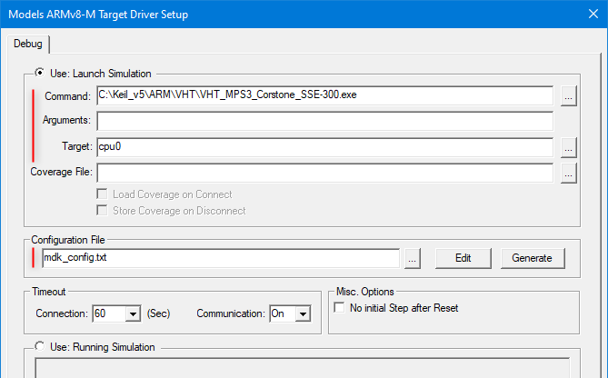

# AVH on Desktop {#Local}

You can use Arm Virtual Hardware with embedded projects locally on your machine.
  - \subpage run_mdk_pro explains how to use Keil MDK for developing and debugging a program with [Arm Fixed Virtual Platforms](../../simulation/html/index.html) running on a local PC.

\page run_mdk_pro Run with MDK-Professional

This section explains how Arm Fixed Virtual Platforms (FVP) can be used with [Keil MDK](https://developer.arm.com/tools-and-software/embedded/keil-mdk) tools for developing and debugging embedded applications on a local computer.

## Tools Installation {#mdk_vht_install}

 - [Download Keil MDK](https://www.keil.com/demo/eval/arm.htm) v5.37 or above and install it on your Windows PC, if not present yet.
 - Ensure that [MDK-Professional Edition](https://developer.arm.com/tools-and-software/embedded/keil-mdk/buy) is activated in MDK as this is required for running AVH models. If MDK-Professional license is not available, you can [request an evaluation license](https://developer.arm.com/documentation/101454/latest/License-Management/MDK-Professional-Evaluation).
 - [*Optional*] Enable Telnet Client on Windows 10. This will allow to observe UART output from the AVH device during debug.
   - Open _Start_ > _Settings_.
   - In the search box, type _Turn Windows features on or off_ and click on the suggested item. The _Windows Features_ dialog opens.
   - Select the _Telnet Client_ check box and click _OK_. The installation might take several minutes to
complete.
   .
   

## Project Configuration {#mdk_project_config}

Two important configuration areas need special attention in MDK projects for Arm FVPs:
 - \ref mdk_vht_targets in the project. This is required for new projects or when changing the target device in an existing project.
 - \ref mdk_vht_debug in the project. This step is typically needed for setting up any project, but with reference AVH examples brief verification of the default settings can be sufficient.

Table below lists the Cortex-M cores supported with Arm Virtual Hardware, corresponding device names, the CMSIS Pack with device support, as well as simulation models provided with MDK.

Arm Cortex-M core | AVH Device name     | CMSIS Pack with device definition     | FVP model in MDK 1 |   Description
:-----------------|:--------------------|:--------------------------------------|:-----------------------------------|:-------------------------------
Cortex-M0         | CMSDK_CM0_VHT       | Keil.V2M-MPS2_CMx_BSP from v1.8.0     | VHT_MPS2_Cortex-M0.exe         | CPU with Cortex-M0 core
Cortex-M0+        | CMSDK_CM0plus_VHT   | Keil.V2M-MPS2_CMx_BSP from v1.8.0     | VHT_MPS2_Cortex-M0plus.exe     | CPU with Cortex-M0+ core
Cortex-M3         | CMSDK_CM3_VHT       | Keil.V2M-MPS2_CMx_BSP from v1.8.0     | VHT_MPS2_Cortex-M3.exe         | CPU with Cortex-M3 core
Cortex-M4         | CMSDK_CM4_VHT       | Keil.V2M-MPS2_CMx_BSP from v1.8.0     | VHT_MPS2_Cortex-M4.exe         | CPU with Cortex-M4 core
Cortex-M4, FP     | CMSDK_CM4_FP_VHT    | Keil.V2M-MPS2_CMx_BSP from v1.8.0     | VHT_MPS2_Cortex-M4.exe         | CPU with Cortex-M4 core and Floating Point Unit (FPU) support
Cortex-M7         | CMSDK_CM7_VHT       | Keil.V2M-MPS2_CMx_BSP from v1.8.0     | VHT_MPS2_Cortex-M7.exe         | CPU with Cortex-M7 core
Cortex-M7, FP(SP) | CMSDK_CM7_SP_VHT    | Keil.V2M-MPS2_CMx_BSP from v1.8.0     | VHT_MPS2_Cortex-M7.exe         | CPU with Cortex-M7 core and Single Precision FPU support
Cortex-M7, FP(DP) | CMSDK_CM7_DP_VHT    | Keil.V2M-MPS2_CMx_BSP from v1.8.0     | VHT_MPS2_Cortex-M7.exe         | CPU with Cortex-M7 core and Double Precision FPU support
Cortex-M23        | IOTKit_CM23_VHT     | Keil.V2M-MPS2_IOTKit_BSP from v1.5.0  | VHT_MPS2_Cortex-M23.exe        | CPU with Cortex-M23 core
Cortex-M33        | IOTKit_CM33_VHT     | Keil.V2M-MPS2_IOTKit_BSP from v1.5.0  | VHT_MPS2_Cortex-M33.exe        | CPU with Cortex-M33 core
Cortex-M33, FP    | IOTKit_CM33_FP_VHT  | Keil.V2M-MPS2_IOTKit_BSP from v1.5.0  | VHT_MPS2_Cortex-M33.exe        | CPU with Cortex-M33 core and Floating Point Unit (FPU) support
Cortex-M55        | SSE-300-MPS3        | ARM.V2M_MPS3_SSE_300_BSP from v1.2.0  | VHT_MPS3_Corstone_SSE-300.exe VHT_Corstone_SSE-300_Ethos-U55.exe VHT_Corstone_SSE-300_Ethos-U65.exe| Corstone-300 SoC with Cortex-M55. Same  device definition is used, but a model shall be selected depending on the required microNPU (none, Ethos-U55 or Ethos-U65)
Cortex-M85        | SSE-310-MPS3        |  not available yet                    | VHT_Corstone_SSE-310.exe           | CPU with Cortex-M85 core

>  1 The Fixed Virtual Platforms can be found in the `/ARM/VHT/` folder in the MDK installation directory as used for \ref mdk_vht_install, for example,`C:/Keil_v5/ARM/VHT/`.

### Target selection {#mdk_vht_targets}

AVH device support is implemented with the same CMSIS principles as used for real hardware targets and explained in [CMSIS Pack](https://arm-software.github.io/CMSIS_5/Pack/html/index.html) and [CMSIS-Core(M)](https://arm-software.github.io/CMSIS_5/Core/html/index.html).

When opening an existing MDK project or importing it from a .cprj file you will be asked if any missing packs required by the project shall be installed. If you agree to that, also the necessary pack with device definition for the target device used in the project will be automatically installed.

When creating a new project or when changing the target in an existing project you need to select an FVP target as follows:
 - Install the CMSIS pack with target device definition, if not present yet:
  - Start [*Pack Installer*](https://developer.arm.com/documentation/101407/latest/Creating-Applications/Software-Components/Pack-Installer) utility.
  - In *Devices* tab expand *ARM* section and select the target Cortex-M core.
  - In the [*Packs* tab](https://developer.arm.com/documentation/101407/latest/Creating-Applications/Software-Components/Pack-Installer/Packs-Dialog) under *Device Specific* category select the target CMSIS pack that implements the required AVH device according to the table in \ref  mdk_project_config.
  - Press *Install* or *Update* button in the Action field to get the latest version installed. For example for Arm Cortex-M4: 
  
  - Observe the button status changed to *Up to date* and return to the project in µVision.
 - Select AVH device as the target in your project:
  - In the project open *Options for target...* dialog and select *Device* tab.
  - In the list of device vendors expand *ARM* group.
  - Expand the group of your target Cortex-M core.
  - In the list select the target device according to the table in \ref mdk_project_config and press *OK*. 
  For example for Arm Cortex-M4: 
 

### Run and debug configuration {#mdk_vht_debug}

Perform the following steps to configure execution and debug of an MDK project on an AVH device:

 - Open _Options for Target..._ dialog and navigate to the  _Debug_ tab.
 - In _Use:_ drop-down menu select the *Models Debugger*.
   The exact name varies slightly depending on the target device core: *Models Cortex-M Debugger* for Cortex-M0/M0+/M3/M4/M7 devices and *Models ARMv8-M Debugger* for Cortex-M23/M33/M55/M85.
   For example for Corstone-300 with a Cortex-M55 core: 
 
 - Click on the _Settings_ button. This opens corresponding *Models Target Driver Setup_ dialog*.
     Following fields are important to fill:
  - *Command*: shall contain the path to the AVH model executable file that corresponds to the selected AVH device. See table in \ref mdk_project_config.
  - *Arguments*: can be used to specify additional [FVP command-line options](https://developer.arm.com/documentation/100966/1116/Getting-Started-with-Fixed-Virtual-Platforms/FVP-command-line-options) to be used with the model execution.
  - *Target*: specifies the CPU to be used for execution. Click the *Browse* button (...) and select the target CPU available on the target.
  - *Configuration File*: points to the file with model configuration parameters (passed to the model executable with `-f` option).
   A correct configuration for Corestone-300 can be as follows: 
    
  .
[Fast Models Debug Driver Configuration](https://developer.arm.com/documentation/101452/latest/Debug-Driver-Configuration) explains the configuration dialog in details.
 .
 - Back in the  _Debug_ tab, in the *Initilization File* field, use the ... button to provide a path to a file that assigns `CORE_CLK` to the same value as specified for the `core_clk.mul` parameter in the model configuration file. This ensures that the timing for MDK displays is correctly calculated in synch with the simulation. *Edit* button can be used to view and modify the file in the µVision editor. Figure below shows the example configuration and content of the files used, *mdk_fvp_config.txt* and *mdk_fvp_init.ini*: 
  
.

## Project Export {#mdk_cprj_export}

Universal [.cprj format](https://arm-software.github.io/CMSIS_5/Build/html/cprjFormat_pg.html) is required for building the program with Arm Virtual Hardware cloud environment. So it is important to keep the MDK project files and the _cprj_ file synchronized. For that after saving modifications in the MDK project go to the µVision menu [_Project_ - _Export_](https://developer.arm.com/documentation/101407/latest/User-Interface/Project-Menu-and-Commands/Export-Menu) and select _Save project to CPRJ format_.

## Program Build and Debug {#mdk_program_run}

Project build and debug on an AVH device can be done in the similar way as any other Keil MDK project:

 - Press _Rebuild_ button in µVision toolbar (or use `F7` hotkey).
 - Start the debug session from µVision toolbar (or with `Ctrl-F5`). The model executable window should pop up (with `C:\WINDOWS\system32\cmd.exe`) but it will stay empty during the session.
 - If enabled in \ref mdk_vht_debug, a Telnet client will start. Program output should be expected there.
 - Debug the project as usual with available µVision functionality. Refer to [µVision User's Guide](https://developer.arm.com/documentation/101407) for details about user interface and debug capabilities.
