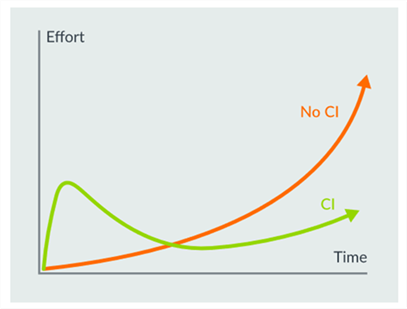

# User Benefits {#User_Benefits}

## Test without Hardware {#No_Hardware}

AVH FVP models allow to verify your code without the need for physical hardware which provides a robust test environment that enables:
 - Early software development for faster time-to-market
 - Select optimal target device once the software workload is analysed
 - Re-target applications to production hardware with driver abstractions

## Verify Correctness {#Verify_Benefits}

AVH FVP simulation models are validated with the same process as the CPU IP. Specially it allows you to:
 - Perform algorithm testing with identical logical behaviour of the target device
 - Precisely repeat complex input patterns in CI/CD test environments
 - Analyse software behaviour with event annotations

## Evaluate Performance {#Perf_Benefits}

Software algorithms for Digital Signal Processing (DSP) or Machine Learning (ML) frequently require significant CPU resources and need to be optimized for the target hardware. Comparing performance of such "load heavy" algorithms requires that they can be automatically executed with different configurations parameters but using identical input. The timing in AVH FVP models is based on a instruction count, therefore it is not timing accurate. However the results can still be used for performance estimation and A/B comparison of algorithms.  

**AVH FVP** simulation models allow users to test their programs at scale with reproducible input patterns. This allows you to validate and optimize application performance. Usage examples are:
 - Compare speed of different implementations of an algorithm (A/B test).
 - Optimize resources (i.e. RTOS memory buffers for stream processing) towards application requirements.

## Continuous Testing {#CI_Benefits}

Applying continuous integration work flows for embedded applications can be complicated by the specifics of development environments and the need of executing the program on target hardware. Development teams are often reluctant to spend initial effort setting up the continuous integration (CI) workflow even though the long-term benefits are undisputed as shown on the figure below.

[AVH FVP Infrastructure](../../infrastructure/html/index.html) with integration in tools such as Keil MDK and GitHub Actions simplifies setup of CI workflows.

For unit and integration tests virtual targets offer additional advantages over hardware, including:
 - **Speed** - no overhead for flashing the application on physical hardware. This saves time on small and fast unit tests.
 - **Scale** - virtual platforms can scale to run many tests in parallel. This makes virtual platforms more cost-effective than a farm of physical hardware.
 - **Maintenance** – unlike physical hardware, virtual platforms do not overheat, wear out from overuse, break from misuse, or use physical space and resources.
 - **Upgrades** – virtual platforms can be adapted and re-configured to match corresponding changes to the underlying hardware platform that is under development. These types of changes can be costly or impossible with physical hardware.
