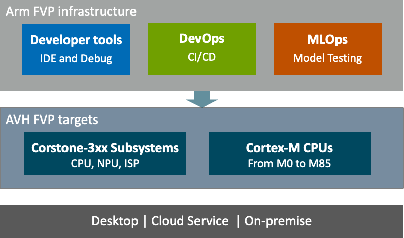

\mainpage Introduction

[comment]:[TOC]

[Arm Virtual Hardware (AVH)](https://www.arm.com/products/development-tools/simulation/virtual-hardware) covers various solutions for software development on Arm-based processors using virtual targets. This includes virtual simulation models, their cloud-native deployments and integrations with development tools.

AVH supports the software development cycle of embedded, IoT, and ML applications and provides essential components for effective integration into Continuous Integration/Continuous Delivery ([CI/CD](https://en.wikipedia.org/wiki/CI/CD)) and [MLOps](https://en.wikipedia.org/wiki/MLOps) development flows.

> **Note:**
> - This documentation is dedicated to the **AVH FVPs**: Arm Virtual Hardware with Fixed Virtual Platforms.
> - For details about Arm Virtual Hardware board models powered by **Corellium** refer to [Corellium AVH Support Center](https://support.avh.corellium.com/).

# AVH FVP Models {#avh_models}

AVH FVP simulation models are standalone programs that gets executed in the target environment and enable execution of firmware programs on virtual targets.

 - Precise simulation models of Arm Cortex-M based reference platforms, such as Corstone-3xx. Learn more at [Simulation](../../simulation/html/index.html).
 - Available for cloud-native and desktop environments. See [Infrastructure](../../infrastructure/html/index.html) for details.

# AVH FVP Infrastructure {#avh_integrations}

Arm Virtual Hardware models integrate well in various tools and services for development, debug, testing as well as CI/CD and MLOps flows. AVH FVPs are already supported within many Arm tools, as well as by third-party vendors. See [Infrastructure](../../infrastructure/html/index.html) for more details.

# AVH FVP Developer Resources {#avh_dev}

Various Resources explain how to integrate Arm Virtual Hardware into workflows common for generic embedded software development, CI testing and MLOps.

Usage examples show typical use cases and range from audio processing, ML algorithm testing, up to IoT applications that interface to Cloud Service providers and Over-the-Air Firware Updates (OTAU).

This documentation is structured into following chapters:

Chapter                                                    | Description
:----------------------------------------------------------|:--------------------
[**Overview**](index.html)                                 | Introduces **Arm Virtual Hardware** along with the top-level structure.
[**Simulation**](../../simulation/html/index.html)         | Explains the AVH FVP simulation technology and the virtual interfaces.
[**Infrastructure**](../../infrastructure/html/index.html) | Describes key integrations of AVH FVPs locally and in the cloud.
[**Examples**](../../examples/html/index.html)             | Guides through the examples that demonstrate how to use AVH FVPs.

# Feedback and Support {#Support}

Arm Virtual Hardware is supported via this [Arm forum](https://community.arm.com/support-forums/f/arm-virtual-hardware-forum).
