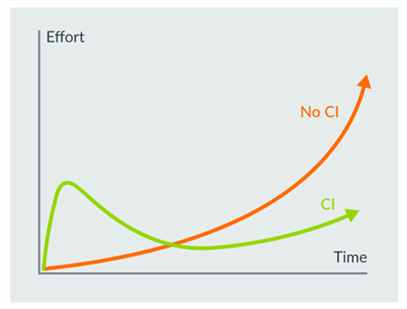

\mainpage Introduction

[comment]:[TOC]

[Arm Virtual Hardware (AVH)](https://www.arm.com/products/development-tools/simulation/virtual-hardware) covers various solutions for software development on Arm-based processors using virtual targets. This includes virtual simulation models, their cloud-native deployments and integrations with development tools.

AVH supports the software development cycle of embedded, IoT, and ML applications and provides essential components for effective integration into Continuous Integration/Continuous Delivery ([CI/CD](https://en.wikipedia.org/wiki/CI/CD)) and [MLOps](https://en.wikipedia.org/wiki/MLOps) development flows.

# AVH Models {#avh_models}

AVH simulation models enable execution of software programs on virtual targets. Two different AVH modelling technologies are available:

  <h2>AVH Fixed Virtual Platforms (FVPs)</h2>

  - Precise simulation models of Arm Cortex-M based reference platforms, such as Corstone-300/310. Learn more at [Sumulation](../../simulation/html/index.html).
  - Available for cloud-native and desktop environments. See [Infrastructure](../../infrastructure/html/index.html) for details.

  <h2>AVH Corellium models</h2>

   - Functionally accurate virtual representations of popular IoT development boards and selected Arm reference platforms:
     - Cortex-A based systems with Linux OS support, such as Raspberry Pi and NXP i.MX.
     - Selected Cortex-M based kits.
   - Software binary-compatible with the hardware targets.
   - Available via [app.avh.arm.com](https://app.avh.arm.com/) cloud platform. Read more in [AVH Users's Guide](https://developer.arm.com/docs/107660).

# AVH Integrations {#avh_integrations}

Arm Virtual Hardware models integrate well in various tools and services for development, debug, testing as well as CI/CD and MLOps flows. AVH is already  supported within many Arm tools, as well as by third-party vendors.

The integration approach depends on the modelling technology:
- AVH FVP models are standalone programs that gets executed in the target environment. See [Infrastructure](../../infrastructure/html/index.html) for more details.
- AVH Corellium models are cloud-native and gets integrated via REST API and SSH connections. See [AVH Users's Guide](https://developer.arm.com/docs/107660)

# AVH Developer Resources {#avh_dev}

Various Resources explain how to integrate Arm Virtual Hardware into workflows common for generic embedded software development, CI testing and MLOps.

Usage examples show typical use cases and range from audio processing, ML algorithm testing, up to IoT applications that interface to Cloud Service providers and Over-the-Air Firware Updates (OTAU).

**This documentation** is largely dedicated to **AVH FVPs** and has following sections that can be accessed as document tabs as well:

Section                                                    | Description
:----------------------------------------------------------|:--------------------
[**Overview**](index.html)                                 | Introduces **Arm Virtual Hardware** along with the top-level structure.
[**Simulation**](../../simulation/html/index.html)         | Explains the AVH FVP simulation technology and the virtual interfaces.
[**Infrastructure**](../../infrastructure/html/index.html) | Describes key integrations of AVH FVPs locally and in the cloud.
[**Examples**](../../examples/html/index.html)             | Guides through the examples that demonstrate how to use AVH FVPs.

For more details about AVH Corellium models refer to [AVH Users's Guide](https://developer.arm.com/docs/107660).

\page User_Benefits User Benefits

# Test without Hardware {#No_Hardware}

AVH allows to verify your code without the need for physical hardware which provides a robust test environment that enables:
 - Early software development for faster time-to-market
 - Select optimal target device once the software workload is analysed
 - Re-target applications to production hardware with driver abstractions

# Verify Correctness {#Verify}

**Arm Fixed Virtual Platforms (FVPs)** are Arm simulation models validated with the same process as the CPU IP. Specially it allows you to:
 - Perform algorithm testing with identical logical behaviour of the target device
 - Precisely repeat complex input patterns in CI/CD test environments
 - Analyse software behaviour with event annotations

# Evaluate Performance {#Evaluate}

Software algorithms for Digital Signal Processing (DSP) or Machine Learning (ML) frequently require significant CPU resources and need to be optimized for the target hardware. Comparing performance of such "load heavy" algorithms requires that they can be automatically executed with different configurations parameters but using identical input. 

**Arm Virtual Hardware Services** allows users to test their programs at scale with reproducible input patterns and so validate and optimize application performance which allows you to:
 - Compare speed of different implementations of an algorithm
 - Identify timing issues during system integration
 - Optimize resources (i.e. data buffers) towards application requirements

# Continuous Testing {#CI}

Applying continuous integration work flows for embedded applications can be complicated by the specifics of development environments and the need of executing the program on target hardware. So the development teams are often reluctant to spend initial effort setting up the continuous integration (CI) workflow even though the long-term benefits are undisputed as shown on the Figure below

**Arm Virtual Hardware** simplifies the setup and use of CI workflows in embedded projects.

For unit and integration tests virtual targets offer additional advantages over hardware, including:
 - **Speed** - no overhead for flashing the application on physical hardware. This saves time on small and fast unit tests. 
 - **Scale** - virtual platforms can scale to run many tests in parallel. This makes virtual platforms more cost-effective than a farm of physical hardware. 
 - **Maintenance** – unlike physical hardware, virtual platforms do not overheat, wear out from overuse, break from misuse, or use physical space and resources. 
 - **Upgrades** – virtual platforms can be adapted and re-configured to match corresponding changes to the underlying hardware platform that is under development. These types of changes can be costly or impossible with physical hardware.

\page History Release History

For details of the AVH AMI content see [AMI Inventory](../../infrastructure/html/ami_inventory.html).

<table>
<tr>
<th>Version</th>
<th>Changes</th>
</tr>
<tr>
<td>1.3.1-beta (Jan 26, 2023)</td>
<td>
 - License validity period for installed Arm tools is extended.
 - EULA for AVH AMI is updated on AWS marketplace.
</td>
</tr>
<tr>
<td>1.3.0-beta (Sept 22, 2022)</td>
<td>
 - Arm Corstone SSE-300 model is supported with [**Keil Studio Cloud**](https://www.keil.arm.com/boards/arm-v2m-mps3-sse-300-fvp-610bb98/).
 - Provided [**eventlist utility**](https://github.com/ARM-software/CMSIS-View/tree/main/tools/eventlist) to process Event Recorder logs obtained with Arm FVP targets.
 - Added new FVP model - VHT_Corstone_SSE-310_Ethos-U65 to the AMI, see [Using Arm Fixed Virtual Platforms](../../simulation/html/Using.html).
 - Added installation of [**CMSIS-Toolbox v1.0.0**](https://github.com/Open-CMSIS-Pack/CMSIS-Toolbox) to the AMI, that also includes CMSIS-Build for command-line project builds.
 - Updated [**examples**](../../examples/html/index.html) to use dynamic credentials (IAM Role) in the GitHub CI workflow, removing the need for storing AWS credentials in GitHub Secrets.
 - Removed preinstalled Bootloader and OpenSuSE software for Corstone-1000.
 - Removed preinstalled CMSIS Packs.
</td>
</tr>
<tr>
<td>1.2.3-beta (July 9, 2022)</td>
<td>
 - Enabled timing annotations in FVPs by default ([FASTSIM_DISABLE_TA](https://developer.arm.com/documentation/100965/1117/Timing-Annotation/Enabling-and-disabling-timing-annotation) is set to 0). If disabled (FASTSIM_DISABLE_TA set to 1), VSI streams data too quickly and prevents normal execution of [ATS-Keyword Example] (https://github.com/ARM-software/open-iot-sdk/tree/main/examples/ats-keyword).
</td>
</tr>
<tr>
<td>1.2.2-beta (May 10, 2022)</td>
<td>
 - New versioning scheme to match the AMI version (see [AMI Inventory](../../infrastructure/html/ami_inventory.html)).
 - [**CMSIS-RTOS2 Validation**](https://github.com/ARM-software/CMSIS-RTOS2_Validation): Advanced test suite for validating CMSIS-RTOS2 implementations on supported Cortex-M cores runs using AVH.
 - Corstone-310 model fixes: NPU access fix as well as a parameter for the flash region size allowing it to be a maximum of 64MB.
</td>
</tr>
<tr>
<td>0.3-beta (Apr 2022)</td>
<td>Added features:
 - [**Corstone-310 and Corstone-1000**](../../simulation/html/Using.html): added new simulation models.
 - [**Integration with Jenkins**](../../infrastructure/html/run_ami_jenkins.html): example of AVH AMI usage in Jenkins CI pipelines.
 - [**Event Recorder Semihosting Support**](https://www.keil.com/pack/doc/compiler/EventRecorder/html/er_use.html#er_semihosting): allows to generate Event Recorder logs in AVH AMI environment.
 - [**AWS MQTT Example**](../../examples/html/aws_mqtt.html): IoT application with MQTT connectivity to AWS cloud service.
 - [**ATS-Keyword Example**](https://github.com/ARM-software/open-iot-sdk/tree/main/examples/ats-keyword): keyword detection application based on [Arm Total Solutions for IoT](https://github.com/ARM-software/ATS-Keyword/).
</td>
</tr>
<tr>
<td>0.2-beta (Feb 2022)</td>
<td>Added features:
 - [**Extended Target support**](../../simulation/html/Using.html): additional Cortex-M processors are supported: Cortex-M0/M0+/M3/M4/M7/M23/M33.
 - [**Support in MDK-Professional**](../../infrastructure/html/run_mdk_pro.html): enables desktop development in classic tooling.
 - [**VIO Interface**](../../simulation/html/group__arm__vio.html): simple interface to control I/O such as switches and LEDs via Python scripts.
 - [**VSocket Interface**](../../simulation/html/group__arm__vsocket.html): BSD socket interface that connects the application under test to networks, including public Internet.
 - [**Get-Started example**](../../examples/html/GetStarted.html): added simple example demonstrating how to setup a Continuous Integration (CI) workflow using Arm Virtual Hardware.
</td>
</tr>
<tr>
<td>0.1-beta (Nov 2021)</td>
<td>Initial release</td>
</tr>
</table>

# Known Limitations {#Issues}

The current beta version of of Arm Virtual Hardware has the following known issues:

[**Virtual Interfaces**](../../simulation/html/group__arm__cmvp.html):
  - After processor reset virtual interfaces may not work correctly. So it is required to restart the debug/run session.

# Feedback and Support {#Support}

Arm Virtual Hardware is supported during public beta via this [Arm forum](https://community.arm.com/support-forums/f/arm-virtual-hardware-forum). Your feedback will influence our future roadmap and we try to help you promptly with your questions.
