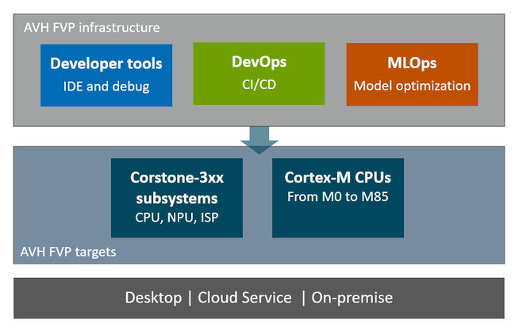

\mainpage Introduction

[comment]:[TOC]

[Arm Virtual Hardware](https://www.arm.com/products/development-tools/simulation/virtual-hardware) covers various
solutions for software development on Arm-based processors using virtual targets. This includes
[Arm FVP](https://developer.arm.com/Tools%20and%20Software/Fixed%20Virtual%20Platforms) simulation models, their
cloud-native deployments and integrations with development tools.

Arm Virtual Hardware supports the software development cycle of embedded, IoT, and ML applications and provides
essential components for effective integration into Continuous Integration/Continuous Delivery
([CI/CD](https://en.wikipedia.org/wiki/CI/CD)) and [MLOps](https://en.wikipedia.org/wiki/MLOps) development flows.

# Simulation Models {#avh_models}

Arm FVP simulation models are standalone programs that gets executed in the target environment and enable execution of
firmware programs on virtual targets. They are:

- Precise simulation models of Arm Cortex-M based reference platforms, such as Corstone-3xx. Learn more at
  [Simulation](../../simulation/html/index.html).
- Available for cloud-native and desktop environments. See [Infrastructure](../../infrastructure/html/index.html) for
  details.

# Infrastructure {#avh_integrations}

Arm Virtual Hardware models integrate well in various tools and services for development, debug, testing as well as
CI/CD and MLOps flows. Arm FVPs are already supported within many Arm tools, as well as by third-party vendors. See
[Infrastructure](../../infrastructure/html/index.html) for more details.

# Developer Resources {#avh_dev}

Various resources explain how to integrate Arm Virtual Hardware into workflows common for generic embedded software
development, CI testing and MLOps.

Usage examples show typical use cases and range from audio processing, ML algorithm testing, up to IoT applications
that interface to cloud service providers and over-the-air firmware Updates (OTA).

This documentation is structured into following chapters:

Chapter                                                    | Description
:----------------------------------------------------------|:--------------------
[**Overview**](index.html)                                 | Introduces **Arm Virtual Hardware** along with the top-level structure.
[**Simulation**](../../simulation/html/index.html)         | Explains the FVP simulation technology and the virtual interfaces.
[**Infrastructure**](../../infrastructure/html/index.html) | Describes key integrations of FVPs locally and in the cloud.
[**Examples**](../../examples/html/index.html)             | Guides through the examples that demonstrate how to use FVPs.

# Feedback and Support {#Support}

Use the [Issues](https://github.com/ARM-software/AVH/issues) tab on the GitHub repository to raise any concerns.
