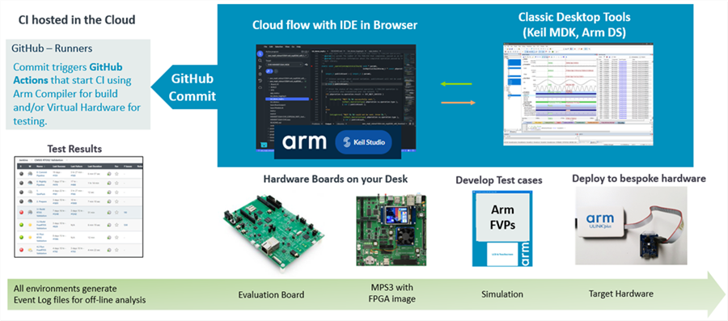

# Development Workflow {#Development_Workflow}

Arm Virtual Hardware enables a flexible approach that combines desktop and cloud-native development tools thus simplifying and accelerating the development workflow.

Using software layers, it is possible to develop a new functionality with a physical board and the commit the changes to a cloud based version control system which executes a complete CI/CD integration flow. This ensures that new product innovations are thoroughly tested before they are integrate into final systems.

For ailure analysis, it is currently recommended to use desktop tools such as [Keil MDK](https://www.keil.arm.com/).

# Migration to Physical Hardware {#Physical_Hardware}

[Modular programming](https://en.wikipedia.org/wiki/Modular_programming) recommends to separate the functionality of a program into independent, interchangeable modules that use defined interfaces that abstract the hardware functionality.

This **"software-first"** design concept simplifies code re-use and allows to implement "Virtual Drivers" and "Hardware Drivers" that expose the same API and implement the same logical behavior. If built correctly, it overcomes many issues that are typically found in monolithic software and enables a staged [software validation](https://en.wikipedia.org/wiki/Software_testing) with multiple test levels such as unit, integration, and system testing.

To simplify re-targeting from AVH FVP simulation models to final production hardware, the examples implement the concept of software layers. As the next generation tooling will provide native support for program layers, it makes it easy to work on a combination of simulated and physical hardware. The picture below examplifies this concept.

