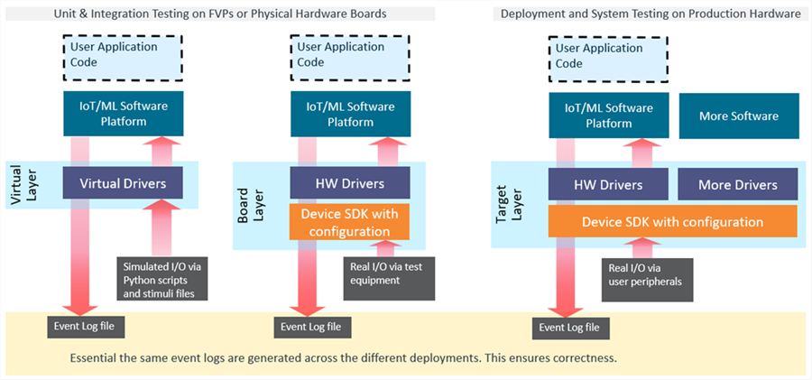

# Development Workflow {#Development_Workflow}

Using AVH FVP models enables a flexible approach that combines desktop and cloud-native development tools thus simplifying and accelerating the development of embedded software.

# Continuous Integration (CI) {#CI_workflow}

New functionality can be quickly developed on a simulation model with frequent changes being automatically verified upon the code commits to a cloud based version control system such as GitHub which executes a complete CI/CD integration flow. Figure below illustrates the concept.

 workflow")

1. **Local development** is done by engineers on local machines using common embedded tools such as Keil MDK with AVH FVP models used for MCU simulation. See [AVH FVPs on Desktop](../../infrastructure/html/avh_desktop.html) for details. The software can also be already prepared for real hardware as explained in \ref Physical_Hardware.
2. **Code repository** is used as a source code management system for synchronization, storage and version control. For example GitHub.
3. **CI pipeline** implements the Continuous Integration flow (for example GitHub Actions) that gets triggered on every code update in the target repository.
4. **CI execution** includes automated program build and testing and is performed in the cloud using the AVH Infrastructure, with results being reported back to the repository and user. See [Infrastructure](../../infrastructure/html/index.html) for details.
5.**Failure analysis and local debug**: developer can observe the CI test results and in case of any failures also uses local setup to reproduce
 and debug the issues.

Learn more about benefits from CI workflow at \ref CI_Benefits.

# Migration to Physical Hardware {#Physical_Hardware}

[Modular programming](https://en.wikipedia.org/wiki/Modular_programming) recommends to separate the functionality of a program into independent, interchangeable modules that use defined interfaces that abstract the hardware functionality.

This **"software-first"** design concept simplifies code re-use and allows to implement "Virtual Drivers" and "Hardware Drivers" that expose the same API and implement the same logical behavior. If built correctly, it overcomes many issues that are typically found in monolithic software and enables a staged [software validation](https://en.wikipedia.org/wiki/Software_testing) with multiple test levels such as unit, integration, and system testing.

To simplify re-targeting from AVH FVP simulation models to final production hardware, the examples implement the concept of software layers. As the next generation tooling will provide native support for program layers, it makes it easy to work on a combination of simulated and physical hardware. The picture below examplifies this concept.

