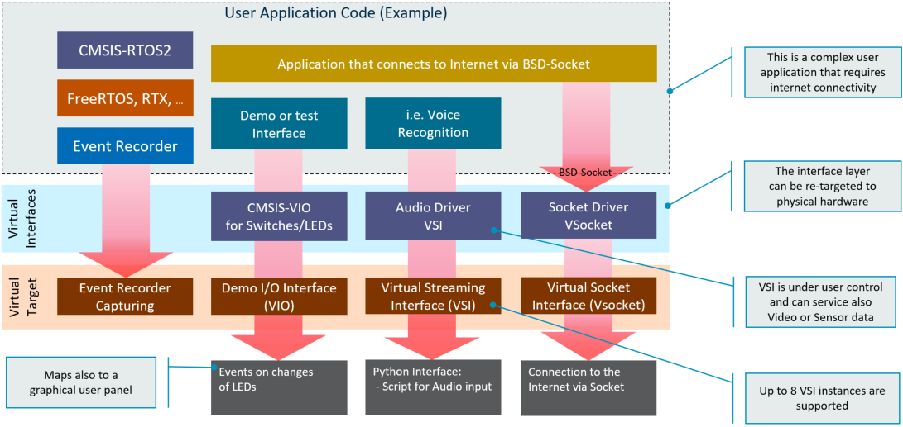

# Overview {#mainpage}

The **AVH Fixed Virtual Platforms (AVH FVPs)** provide functionally accurate simulation models of Arm-based Cortex-M CPUs and Corstone-3xx Subsystems.

The AVH FVP models are standalone programs that can be executed in a target environment. See \ref Models for a list of FVPs provided in the AVH context.

Section \ref using gives an overview how to run an embedded program on a target AVH FVP model using command line interface. [Infrastructure chapter](../../infrastructure/html/index.html) provides details on how to obtain AVH FVPs and use them in various cloud-native or desktop environments workflows, such as GitHub and Keil MDK.

## Available Models {#Models}

The AVH FVP simulation models build a subset of [Arm Fast Models Fixed Virtual Platforms](https://developer.arm.com/tools-and-software/simulation-models/fixed-virtual-platforms) with extensions for \ref arm_cmvp.

The table below lists the available models:

<table>
<tr>
<th style="width:30%">FVP Simulation Model Name        </th><th style="width:16%">Processor Cores   </th><th>Overview Description    </th></tr>
<tr>
<td>FVP_Corstone_SSE-320     </td><td>Cortex-M85, Ethos-U85, Mali-C55   </td><td>[FVP for Arm Corstone SSE-320 Reference Guide](https://developer.arm.com/documentation/109760)  </td></tr>
<tr>
<td>FVP_Corstone_SSE-315     </td><td>Cortex-M85, Ethos-U65, Mali-C55   </td><td>[FVP for Arm Corstone SSE-315 Reference Guide](https://developer.arm.com/documentation/109395)  </td></tr>
<tr>
<td>FVP_Corstone_SSE-310_Ethos-U65   </td><td>Cortex-M85, Ethos-U65   </td><td>[Arm Corstone SSE-310 FVP](https://developer.arm.com/documentation/100966/latest/Arm--Corstone-SSE-310-FVP)  </td></tr>
<tr>
<td>FVP_Corstone_SSE-310     </td><td>Cortex-M85 Ethos-U55   </td><td>[Arm Corstone SSE-310 FVP](https://developer.arm.com/documentation/100966/latest/Arm--Corstone-SSE-310-FVP)    </td></tr>
<tr>
<td>FVP_Corstone_SSE-300_Ethos-U65  </td><td>Cortex-M55, Ethos-U65   </td><td>[Arm Corstone SSE-300 FVP](https://developer.arm.com/documentation/100966/latest/Arm--Corstone-SSE-300-FVP)    </td></tr>
<tr>
<td>FVP_Corstone_SSE-300_Ethos-U55  </td><td>Cortex-M55, Ethos-U55   </td><td>[Arm Corstone SSE-300 FVP](https://developer.arm.com/documentation/100966/latest/Arm--Corstone-SSE-300-FVP)    </td></tr>
<tr>
<td>FVP_Corstone_SSE-300</td><td>Cortex-M55       </td><td>[Arm Corstone SSE-300 FVP](https://developer.arm.com/documentation/100966/latest/Arm--Corstone-SSE-300-FVP)    </td></tr>
<tr>
<td>FVP_MPS2_Cortex-M85      </td><td>Cortex-M85 (2x)  </td><td>[FVP_MPS2_Cortex-M85 in FVP Reference Guide](https://developer.arm.com/documentation/100966/latest/MPS2-Platform-FVPs/FVP-MPS2-Cortex-M85). 
It is recommended to use Corstone-320/315/310 FVP models for Cortex-M85.    </td></tr>
<tr>
<td>FVP_MPS2_Cortex-M55      </td><td>Cortex-M55 (2x)  </td><td>[FVP_MPS2_Cortex-M55 in FVP Reference Guide](https://developer.arm.com/documentation/100966/latest/MPS2-Platform-FVPs/FVP-MPS2-Cortex-M55). 
It is recommended to use Corstone-300 FVP models for Cortex-M55.    </td></tr>
<tr>
<td>FVP_MPS2_Cortex-M52      </td><td>Cortex-M52 (2x)  </td><td>[FVP_MPS2_Cortex-M52 in FVP Reference Guide](https://developer.arm.com/documentation/100966/latest/MPS2-Platform-FVPs/FVP-MPS2-Cortex-M52)  </td></tr>
<tr>
<td>FVP_MPS2_Cortex-M35P     </td><td>Cortex-M35P (2x) </td><td>[FVP_MPS2_Cortex-M35P in FVP Reference Guide](https://developer.arm.com/documentation/100966/latest/MPS2-Platform-FVPs/FVP-MPS2-Cortex-M35P) </td></tr>
<tr>
<td>FVP_MPS2_Cortex-M33      </td><td>Cortex-M33 (2x)  </td><td>[ARM Cortex-M33 IoT Subsystem for V2M-MPS2+ (AppNote AN505)](https://developer.arm.com/documentation/dai0505)    </td></tr>
<tr>
<td>FVP_MPS2_Cortex-M23      </td><td>Cortex-M23 (2x)  </td><td>[ARM Cortex-M23 IoT Subsystem for V2M-MPS2+ (AppNote AN519)](https://developer.arm.com/documentation/dai0519)    </td></tr>
<tr>
<td>FVP_MPS2_Cortex-M7       </td><td>Cortex-M7        </td><td>[ARM Cortex-M7 SMM on V2M-MPS2 (AppNote AN399)](https://developer.arm.com/documentation/dai0386)    </td></tr>
<tr>
<td>FVP_MPS2_Cortex-M4       </td><td>Cortex-M4        </td><td>[ARM Cortex-M4 SMM on V2M-MPS2 (AppNote AN386)](https://developer.arm.com/documentation/dai0386)    </td></tr>
<tr>
<td>FVP_MPS2_Cortex-M3       </td><td>Cortex-M3        </td><td>[ARM Cortex-M3 SMM on V2M-MPS2 (AppNote AN385)](https://developer.arm.com/documentation/dai0385)    </td></tr>
<tr>
<td>FVP_MPS2_Cortex-M0plus   </td><td>Cortex-M0+       </td><td>[ARM Cortex-M0+ SMM on V2M-MPS2 (AppNote AN383)](https://developer.arm.com/documentation/dai0383)   </td></tr>
<tr>
<td>FVP_MPS2_Cortex-M0       </td><td>Cortex-M0        </td><td>[ARM Cortex-M0 SMM on V2M-MPS2 (AppNote AN382)](https://developer.arm.com/documentation/dai0382)    </td></tr>
</table>

## Virtual Interfaces {#Virtual_Interfaces}

The AVH FVPs implement various Virtual Interfaces that can be used to stimulate the application under test.

 - The \ref arm_vio interface controls simple I/O such as LED and switches.
 - The \ref arm_vsi provides up to 8 channels for data streaming.
 - The \ref arm_vsocket connects the user application to [BSD sockets](https://en.wikipedia.org/wiki/Berkeley_sockets) on the Host computer for IP network connectivity.

Both \ref arm_vio "VIO" and \ref arm_vsi "VSI" connect to local python scripts and enable flexible scripting for test automation. Eight VSI interfaces are available and may be used in parallel to stream simultaneous multi-channel inputs and outputs. The interfaces are tailored for simulation, but can also map to physical target hardware, for example to a video camera as a VSI input.

In addition the **Event Recorder Capturing** provides an interface for the [Event Recorder](https://www.keil.com/pack/doc/compiler/EventRecorder/html/er_overview.html) API. This software component enables event annotations in the application code or software component libraries. The **Event Recorder** provides visibility to the dynamic execution of an application, enables RTOS awareness, and [Event Execution Statistics](https://www.keil.com/pack/doc/compiler/EventRecorder/html/group__Event__Execution__Statistic.html) which helps to optimize the timing of complex algorithms.

