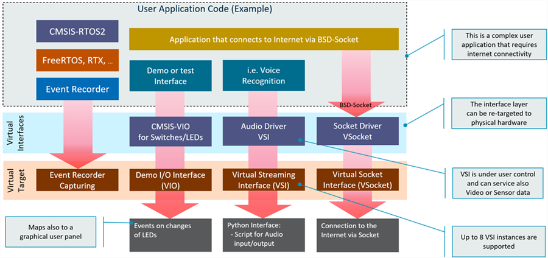

\mainpage \prj_name Targets

The **\prj_name Targets** provide a functional accurate simulation of an Arm-based SoC and can be automated for scalable deployment in the CI development flow. This virtual platform can be used standalone or with development tools such as <a href="https://developer.arm.com/tools-and-software/embedded/arm-development-studio" target="_blank"><b>Arm Development Studio</b></a> or <a href="https://developer.arm.com/tools-and-software/embedded/keil-mdk" target="_blank"><b>Arm Keil MDK</b></a> with debug and trace capabilities supported as well.

The **\prj_name Targets** are based on the Arm Fast Model technology and are extended FVP models that add virtual interfaces for peripheral emulation.  In addition **\prj_name** provides concepts to re-target applications from simulation models to physical hardware which simplifies to combine unit/integration tests with the final system integration.

# Virtual Interfaces {#Virtual_Interfaces}

The **\prj_name Targets** implement various Virtual Interfaces that can be used to stimulate the application under test.

  - The \ref arm_vio_api interface controls simple I/O such as LED and switches.
  - The \ref arm_vsi_api provides up to 8 instances for data streaming. 
  - The \ref arm_vsocket_api "Virtual Socket Interface (Vsocket)" connects the user application to [**BSD sockets**](https://en.wikipedia.org/wiki/Berkeley_sockets) on the Host computer for IP network connectivity.

Both \ref arm_vio_api "VIO" and \ref arm_vsi_api "VSI" connect to Python and enable flexible scripting for test automation. Eight VSI interfaces are available and may be used in parallel to stream simultaneous multi-channel inputs. The interfaces are tailored for simulation, but can also map to physical target hardware.

In addition the **Event Recorder Capturing** provides an interface for the [Event Recorder](https://www.keil.com/pack/doc/compiler/EventRecorder/html/er_overview.html) API. This software component enables event annotations in the application code or software component libraries. The **Event Recorder** provides visibility to the dynamic execution of an application, enables RTOS awareness, and [**Event Execution Statistics**](https://www.keil.com/pack/doc/compiler/EventRecorder/html/group__Event__Execution__Statistic.html) which helps to optimize the timing of complex algorithms.

# Physical Hardware {#Physical_Hardware}

[**Modular programming**](https://en.wikipedia.org/wiki/Modular_programming) recommends to separate the functionality of a program into independent, interchangeable modules that use defined interfaces that abstract the hardware functionality. This design concept simplifies code re-use and allows to implement **Virtual Drivers** and **Hardware Drivers** that expose the same API and implement the same logical behavior. If built correctly, it overcomes many issues that are typically found in monolithic software and enables a staged [software validation](https://en.wikipedia.org/wiki/Software_testing) with multiple test levels such as unit, integration, and system testing.

To simplify re-targeting from **\prj_name Targets** to final production hardware, the examples implement the concept of software layers. As the next generation tooling will provide native support for program layers, it makes it easy to work on a combination of simulated and physical hardware. The picture below examplifies this concept.

# Development Workflow {#Development_Workflow}

Using a flexible workflow that combines desktop and cloud-native development tools simplify the development workflow further. Using software layers, it is possible to possible to develop a new functionality with a physical board and the commit the changes to a cloud based version control system which executes a complete CI/CD integration flow. This ensures that new product innovations are thoroughly tested before they are integrate into final systems. 

This workflow mandates that a set of test cases are developed. For test case development and failure analysis, it is currently recommended to use desktop tools such as [Keil MDK](https://developer.arm.com/tools-and-software/embedded/keil-mdk). However, over time the more flexible [Keil Studio](https://www.keil.arm.com/) will enable a hybrid work-style that allows to use cloud-native or desktop development workflows. 

# Development Challenges {#Development_Challanges}

Naturally, the **\prj_name Targets** cannot simulate the exact behavior of every Arm Cortex processor-based microcontroller that is available today. However, the simulated targets overcome many challenges that users are facing with physical hardware. The **\prj_name Targets** make CI/CD economic for embedded applications and enable modern DevOps workflows that benefit from test automation.  

Challenge  | Solution
:----------|:------------
Over 9000 different Arm based Microcontrollers are available and many have a comprehensive peripheral set along with sophisticated clock and power-down features. Is it possible to simulation bespoke Microcontroller peripherals? Can I validate device-specific drivers?           | It is not economic to simulate specific microcontrollers, but with driver abstraction the behavior of software can be analyzed. The device-specific interfaces should be tested on final target hardware, but the more complex high-level software can be verified using \prj_name.
Arm Fast Models are not timing-accurate and the timing of the memory system is not simulated too. How is it possible to identify timing issues that may appear in final target hardware?         | The simulation is not timing accurate but gives still a good approximation that can be validated using [**Event Statistics**](https://www.keil.com/support/man/docs/uv4/uv4_db_dbg_evr_stat.htm). It is recommended to run simulation at lower clock frequency that maps to worst-case timing of final target hardware.
The **\prj_name Services** provide a cloud-native infra-structure for software test and validation. But currently there is no debug possible with this CI/CD system. How are test cases developed and analysed?       | Today, desktop tools (for example [Keil MDK](https://developer.arm.com/tools-and-software/embedded/keil-mdk)) are required to develop test cases and debug failures. [Development Workflow](./index.html##Development_Workflow) explains this process.
The examples for \ref arm_vsi_api "VSI" show currently Audio streaming.  Is it possible to use this interface also for other data sources?      | The \ref arm_vsi_api "VSI" is a simple, but flexible interface that connects a generic streaming peripheral with Python for test script automation. It is today possible to develop own data streaming interfaces but we work on more examples that show the potential of this interface.

