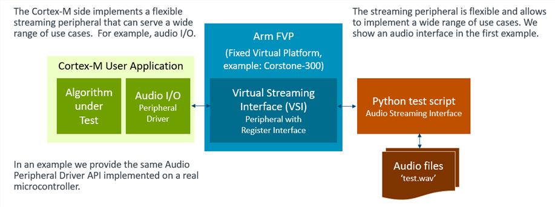

\mainpage Arm VHT Systems

The **Arm \prj_name (VHT) Systems** provide a functional accurate simulation of an Arm-based SoC and can be automated for scalable deployment in the CI development flow. This virtual platform can be used standalone or with development tools such as <a href="https://developer.arm.com/tools-and-software/embedded/arm-development-studio" target="_blank"><b>Arm Development Studio</b></a> or <a href="https://developer.arm.com/tools-and-software/embedded/keil-mdk" target="_blank"><b>Arm Keil MDK</b></a> with debug and trace capabilities supported as well.

# Virtual Streaming Interface (VSI) {#vsi}

This alpha release of **Arm VHT Systems** provides a Virtual Streaming Interface (VSI) for I/O simulation at a logical API driver level. While this interface is flexible, the Audio use-case is currently implemented as shown in the diagram below.
The block-diagram below shows the SW execution on an Arm VHT System.

The **Arm VHT Systems** implement multiple Virtual Streaming Interface (VSI) peripheral that can be used to simulate data streaming input such as audio, video and various sensors frequently found in Machine-Learning applications.

The \ref arm_vsi_api "VSI" implements a peripheral with register interface that provides:
  - 64 user registers
  - Timer peripheral with 1MHz input clock
  - DMA peripheral with automated block buffer handling
  
A read or write access to the \ref arm_vsi_api "VSI" peripheral registers triggers the \ref arm_vsi_py "VSI Python interface" which provides a script interface for software testing.

Eight VSI interfaces are available and may be used in parallel to stream simultaneous multi-channel inputs. The following files are provided:

File                             | Description
:--------------------------------|:-----------------------------------
./interface/include/arm_vsi.h    | \ref arm_vsi_api "VSI" API header files
./interface/python/arm_vsi0.py   | \ref arm_vsi0_py "VSI Python interface" script template for instance 0
./interface/python/arm_vsi1.py   | \ref arm_vsi1_py "VSI Python interface" script template for instance 1
./interface/python/arm_vsi2.py   | \ref arm_vsi2_py "VSI Python interface" script template for instance 2
./interface/python/arm_vsi3.py   | \ref arm_vsi3_py "VSI Python interface" script template for instance 3
./interface/python/arm_vsi4.py   | \ref arm_vsi4_py "VSI Python interface" script template for instance 4
./interface/python/arm_vsi5.py   | \ref arm_vsi5_py "VSI Python interface" script template for instance 5
./interface/python/arm_vsi6.py   | \ref arm_vsi6_py "VSI Python interface" script template for instance 6
./interface/python/arm_vsi7.py   | \ref arm_vsi7_py "VSI Python interface" script template for instance 7

## Audio Streaming Interface via VSI {#vsi_audio}

An reference implementation of an audio input interface is provided with the implementation files listed in the following table.
There are two implementations of the audio driver: 
  - for the \ref arm_vsi_api "VSI" with an interface to a Python test script that streams *.wav files.
  - for an NXP iMXRT1064 evaluation board that uses a microphone as audio input.

File                                                                                 | Description
:------------------------------------------------------------------------------------|:-----------------------------------
./interface/audio/include/audio_drv.h                                                | \ref arm_vsi_audio "Audio via VSI"  API header file
./interface/audio/driver/audio_drv.c                                                 | \ref arm_vsi_audio "Audio via VSI"  Implementation based on \ref arm_vsi_api "VSI"
./interface/audio/python/arm_vsi0.py                                                 | \ref arm_vsi_audio "Audio via VSI"  Python test script for audio input interface based on \ref arm_vsi_py "VSI Python interface" 
./examples/micro_speech/Platform_MIMXRT1064-EVK/Driver_Audio/Audio_MIMXRT1064-EVK.c  | \ref arm_vsi_audio "Audio via VSI"  Implementation for NXP iMXRT1064

The chapter [**Examples**](../../examples/html/index.html) describes projects that demonstrate use of this audio driver API in both the Arm VHT test environment and on the NXP MIMXRT1064-EVK evaluation board.

\if NotAvailYet

# Virtual Socket Interface (VSocket) {#vsocket}

# Virtual IO Interface (VIO) {#vio}

\endif

