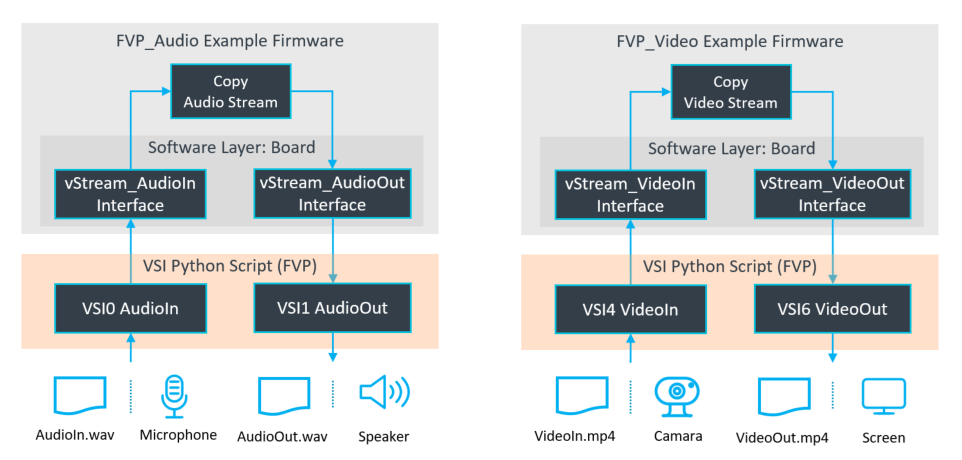

# Introduction

The AVH_FVP software pack delivers comprehensive developer resources, examples, and reference implementations for [Arm Fixed Virtual Platforms (FVP)](https://www.arm.com/products/development-tools/simulation/fixed-virtual-platforms) with **Virtual Interfaces**.

FVP simulation models of [Arm Cortex-M reference platforms](https://arm-software.github.io/AVH/main/simulation/html/index.html) run directly on your host system (Windows or Linux), providing accurate virtual hardware targets for firmware validation. FVP simulation models are included in [Keil MDK](https://www.keil.arm.com/) and integrate seamlessly with Keil Studio, command-line environments, and [CI/CD workflows](https://github.com/Arm-Examples/.github/blob/main/profile/CICD.md).

## Virtual Interfaces

[**Virtual Interfaces**](https://arm-software.github.io/AVH/main/simulation/html/index.html#Virtual_Interfaces) bridge your firmware's I/O with host system resources, enabling powerful test automation and flexible development workflows:

- **VIO** - Virtual I/O for LEDs, switches, and simple peripheral controls.
- **VSI** - Virtual Streaming Interface for high-throughput data streaming.
- **VSocket** - BSD socket connectivity for network protocol testing.

## VSI Implementations

The **Virtual Streaming Interface (VSI)** provides **8 independent channels** (VSI0 - VSI7) for flexible data streaming between firmware and host system. Each channel connects to a Python script that implements the host-side peripheral behavior. The AVH-FVP software pack contains reference implementations for firmware drivers (using the [CMSIS-Driver vStream](https://arm-software.github.io/CMSIS_6/latest/Driver/group__vstream__interface__gr.html) API) and corresponding Python scripts.

- **VSI0-1**: Audio streaming (input/output) with support for multiple formats and sample rates.
- **VSI2**: Sensor data streaming (accelerometer, gyroscope, temperature, and more).
- **VSI3**: Used in [SDS Framework](https://www.keil.arm.com/packs/sds-arm/overview/) for data streaming.
- **VSI4-7**: Video streaming channels supporting various color formats and frame rates.

The Python-based peripheral scripts enable rapid prototyping and testing without physical hardware. Applications can use multiple VSI channels simultaneously to simulate complex multi-peripheral systems, making it ideal for ML model validation, sensor fusion testing, and signal processing application development.

## Examples

The AVH-FVP pack includes ready-to-run examples:

- **FVP_Hello** - Simple application that demonstrates FVP setup and debug output. Ideal starting point for new projects.
- **FVP_Audio** - Audio streaming demonstration using [vStream API](https://arm-software.github.io/CMSIS_6/latest/Driver/group__vstream__interface__gr.html) for audio input/output (VSI0-1). Captures audio samples and streams them through the audio output with configurable sample rates, bit depths, and channels.
- **FVP_Video** - Video streaming demonstration using [vStream API](https://arm-software.github.io/CMSIS_6/latest/Driver/group__vstream__interface__gr.html) for video input/output (VSI4-5). Captures video frames and displays them with configurable resolution and color formats.

These examples are configured for the [FVP Corstone platforms (SSE-300, SSE-310, SSE-315, SSE-320)](https://arm-software.github.io/AVH/main/simulation/html/index.html) and work out-of-the-box with pre-configured FVP simulation settings. They can be built using CMSIS-Toolbox or Keil Studio. The FVP_Audio and FVP_Video examples use Python scripts to access data files on the host system. With configuration options, the host system peripherals can also be used for I/O.

By adding a compatible [Software Layer: Board](https://open-cmsis-pack.github.io/cmsis-toolbox/build-overview/#software-layers), the examples can be tested on FVP simulation models or physical hardware boards. To run these examples on a physical board, you may use the [Reference Application](https://open-cmsis-pack.github.io/cmsis-toolbox/ReferenceApplications/) workflow, where Keil Studio adds a compatible board layer from a BSP.

## Getting Started

1. **Install the pack**: Add the pack `ARM::AVH_FVP` to your development environment.
2. **Run Hello example**: Build and run the FVP_Hello example on your chosen FVP Corstone platform to verify setup.
3. **Explore vStream examples**: Try FVP_Audio or FVP_Video example to experience Virtual Interfaces in action.

## Additional Resources

- [**Documentation**](https://arm-software.github.io/AVH)
- [**Arm-Examples that use FVP simulation**](https://github.com/search?q=topic%3Afvp+org%3AArm-Examples+fork%3Atrue&type=repositories)